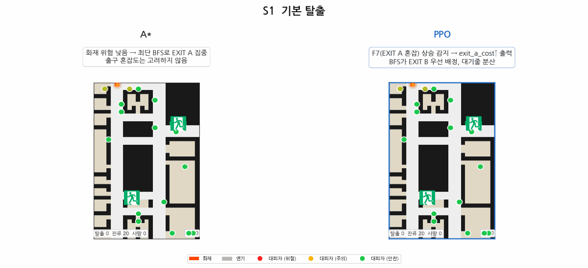
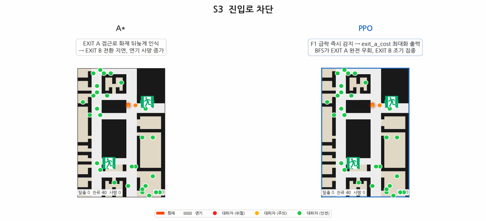
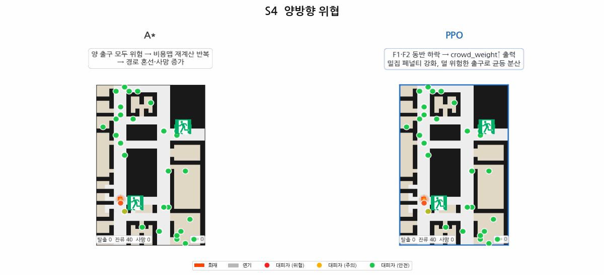
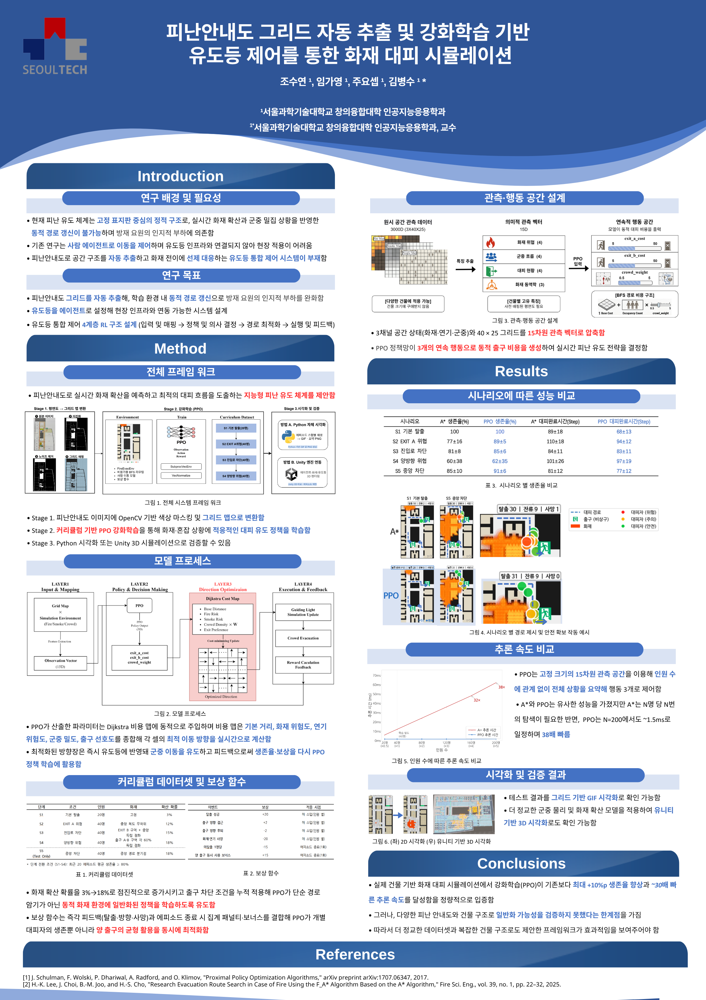

# 피난안내도 그리드 자동 추출 및 강화학습 기반 유도등 제어를 통한 화재 대피 시뮬레이션

조수연 · 임가영 · 주요셉 · 김병수 (서울과학기술대학교 창의융합대학 인공지능응용학과)

---

## 개요

피난안내도 이미지에서 그리드 맵을 자동으로 추출하고, 강화학습(PPO)으로 유도등 방향을 실시간 제어하는 3단계 파이프라인이다.  
기존 정적 유도등과 달리 화재 확산·군중 밀집을 반영한 **동적 경로 갱신**이 가능하고, 방재 요원의 인지적 부하도 낮춘다.

```
[피난안내도 이미지]
      │  Stage 1: OpenCV 색상 마스킹 → 그리드 변환
      ▼
[40×25 그리드 맵 (grid_map.npy)]
      │  Stage 2: 커리큘럼 기반 PPO 강화학습
      ▼
[학습된 PPO 정책: 3개 연속 행동으로 유도등 실시간 제어]
      │  Stage 3: Python 시각화 / Unity 3D 시뮬레이션
      ▼
[2D GIF 검증] ·············· [Unity 기반 3D 시각화]
```

---

## 관련 연구

동적 대피 유도(dynamic evacuation guidance)에 강화학습을 적용한 선행 연구와 비교했다.
차별점은 두 가지다: (1) 그리드 크기에 독립적인 15차원 고정 관측(F1~F15)으로 인원 수
N과 무관하게 추론 속도가 일정, (2) A* 3개 변형(Hazard-aware/Simple/Pure)과 직접 비교해
"왜 정적 A*가 아니라 학습된 정책이 필요한가"를 정량적으로 제시.

| 연구 | 접근 방법 | 이 프로젝트와의 차이 |
|---|---|---|
| Xie et al. (2025) [3] | CTM 기반 메조스코픽 군중 모델 + PyroSim 화재 시뮬레이션 + QMIX(MARL)로 동적 표지판 최적화 | 가장 근접한 선행 연구(동적 유도등 + 화재 전파 + RL). 멀티에이전트 QMIX로 표지판 자체를 에이전트화하는 반면, 본 프로젝트는 단일 정책이 전역 출구 가중치를 출력하는 단순한 구조 |
| Xu et al. (2021) [4] | 다중 출구 대피를 DRL로 시뮬레이션 (Transactions in GIS) | 화재 확산·병목을 명시적으로 모델링하지 않고 정적 다중 출구 선택 문제에 가까움 |
| Zhang, Chai & Lykotrafitis (2021) [5] | Social force model 기반 particle dynamics 환경 + DRL(Dyna-Q), 오목 장애물 회피 | 개별 에이전트 경로계획이 목적. 본 프로젝트처럼 "유도 시스템(출구 가중치)"을 학습하는 게 아니라 에이전트 자체의 이동 정책을 학습 |
| Lee et al. (2025) [2] | F_A\*(A\* 알고리즘 기반 화재 상황 대피 경로 탐색) | 학습 없는 휴리스틱 경로탐색. 본 프로젝트의 A\* 베이스라인과 같은 계열, RL 비교 대상 |

> **데이터 방식 비교**: 위 4편 모두 실제 화재·군중 raw 데이터를 쓰지 않는다.
> 가장 근접한 선행연구인 Xie et al. (2025)도 실제 노래방 건물의 **평면도만**
> 실사용하고 화재·군중 자체는 CTM+PyroSim 시뮬레이션이다(본 프로젝트가 Unity
> 평면도는 실사용, 화재·군중은 시뮬레이션인 구조와 동일). 순수 시뮬레이션이
> 이 니치(RL 기반 화재/군중 대피)의 표준 관행이다.

---

## 방법론

### Stage 1: 피난안내도 그리드 추출

Unity 에디터에서 캡처한 2층 평면도 이미지를 처리해 `grid_map.npy`(40×25 정수 배열)를 생성한다.

| 단계 | 처리 내용 |
| :--- | :--- |
| 색상 필터링 | HSV 범위로 빨강·파랑 노이즈 제거 |
| 이진화 | 어두운 픽셀(벽·칸막이)을 검은색으로 추출 |
| 연결 컴포넌트 | 작은 아티팩트 제거 |
| 그리드 매핑 | 픽셀 → 셀 타입 (HALL / WALL / EXIT / ROOM) |

```bash
cd stage1
python gridcell_extract.py
# 출력: grid_map.npy, grid_cell_vis.jpg
```

---

### Stage 2: 강화학습 기반 유도등 제어

#### 모델 프로세스 (4계층 구조)

```
LAYER 1: 입력 및 매핑
  그리드 맵 (40×25) + 화재·연기·군중 상태
          ↓
LAYER 2: 정책 및 의사 결정 (PPO)
  관측 벡터 F1~F15 (15차원) → PPO 신경망
  → [exit_A_cost, exit_B_cost, crowd_weight]
          ↓
LAYER 3: 방향 최적화 (Dijkstra Cost Map)
  화재 위험 + 연기 위험 + 군중 밀도 → 비용 맵
  Dijkstra 경로 탐색 → 각 셀 최적 방향 결정
          ↓
LAYER 4: 실행 및 피드백
  유도등 방향 갱신 → 군중 이동 → 생존율 보상 → PPO 학습
```

---

#### 관측 공간 (F1~F15)

15차원 스칼라 피처로, 3채널 상태(화재·군중·연기)를 40×25 그리드로 압축한 관측 벡터다. 그리드 크기에 독립적이라 Unity 이식도 가능하다.

| 인덱스 | 피처 | 내용 |
| :---: | :--- | :--- |
| F1 | 출구 A 화재 위협 | 화재→출구A 최단거리 / 20 (1=안전, 0=위험) |
| F2 | 출구 B 화재 위협 | 화재→출구B 최단거리 / 20 |
| F3 | 출구 A 선호 비율 | 출구 A가 더 가까운 생존자 비율 |
| F4 | 탈출 완료 비율 | |
| F5 | 사망 비율 | |
| F6 | 시간 경과 비율 (긴급도) | |
| **F7** | **출구 A 근접 혼잡도** | BFS 거리 4 이내 생존자 비율 ★ |
| **F8** | **출구 B 근접 혼잡도** | BFS 거리 4 이내 생존자 비율 ★ |
| F9 | 평균 공황 수준 | Helbing (2000) |
| F10 | 생존자→출구 A 평균 BFS 거리 | / 50 정규화 |
| F11 | 생존자→출구 B 평균 BFS 거리 | / 50 정규화 |
| F12 | 화재 무게중심 행 | / ROWS |
| F13 | 화재 무게중심 열 | / COLS |
| F14 | 출구 A 위협 변화율 | 이전 스텝 대비 F1 감소량 |
| F15 | 출구 B 위협 변화율 | 이전 스텝 대비 F2 감소량 |

> ★ **F7/F8**: A\*는 이 피처를 사용하지 않는다. PPO는 이를 이용해 병목
> 상황에서 더 유리한 쪽 출구로 몰아 처리 효율(Throughput)을 높인다(양쪽
> 출구를 균등하게 나누는 것은 아니다. 실측 근거는 실험 결과 절 참고).

---

#### 커리큘럼 데이터셋 (표 1)

최근 50 에피소드 평균 탈출완료율 ≥ 85% 달성 시 자동 진급.

| 단계 | 시나리오 | 인원 | 화재 위치 | 확산 확률 | 진급 조건 |
| :---: | :--- | :---: | :--- | :---: | :--- |
| S1 | 기본 탈출 | 20명 | 고정 위치 | 3% | 탈출완료 ≥ 90% |
| S2 | EXIT A 위협 | 40명 | 우측 구역 상단 | 12% | 탈출완료 ≥ 85% |
| S3 | 진입로 차단 | 40명 | EXIT A 접근로 | 18% | 탈출완료 ≥ 85% |
| S4 | 양방향 동시 위협 | 40명 | 출구 A·B 구역 | 15% | 탈출완료 ≥ 80% |

> 커리큘럼은 S1~S4까지만 진행되며(`--max-scenario 4`), S5(EXIT B 위협)는
> 학습에서 완전히 제외해 out-of-distribution 일반화 테스트로 남겨둔다.
> 상세는 실험 결과 절 참고.

---

#### 보상 함수 (표 2)

| 이벤트 | 보상 |
| :--- | :---: |
| EXIT 탈출 성공 | +20.0 |
| 출구 방향 접근 (urgency 배율 ×1.0~×3.0) | +Δ |
| 화재·연기 사망 | −20.0 |
| 에피소드 종료 시 미탈출 1명당 | −15.0 |
| 두 출구 모두 사용 (분산 보너스) | +15.0 |

> **urgency 배율**: 스텝 경과에 따라 ×1.0 → ×3.0으로 증가 (타임아웃 억제)
>
> **분산 보너스가 있어도 실제 학습된 정책은 균형보다 처리 효율을 우선한다**
> (Exit Balance 실측 결과는 실험 결과 절 참고). 다른 보상 항목(생존·사망·
> 잔류 페널티)의 크기가 더 커서, 최종적으로는 "고르게 나누기"보다 "더 나은
> 쪽으로 몰아 빨리 처리하기"가 우세한 전략으로 수렴한 것으로 보인다.

---

## 실험 결과

> 조건: 30 에피소드 | EXIT_CAPACITY=1 / CELL_CAPACITY=1 병목 적용 | PPO 3,500,000 학습
> 스텝(커리큘럼 S1→S4, `--max-scenario 4`로 S5는 학습에서 제외) | `--seed 42` 페어링
> (A\*/PPO/정적 유도등이 매 에피소드 동일한 화재·시작 조건을 겪음)

### 시나리오별 성능 비교 (표 3)

세 가지 유도 전략을 비교한다. **정적 유도등**은 최초 1회 계산한 경로를
화재·군중 상태와 무관하게 고정한다(EC directive 92/58/EEC 준수 표준
표지판과 같은 원리로, 동적 유도등 문헌의 표준 비교군이다). **A\***는 매 스텝
재탐색하되 화재를 무시하는 순수 최단경로(Pure A\*, Manhattan 휴리스틱).
**PPO**는 학습된 정책. A\*·정적 유도등 모두 `hazard_aware=False`로 평가해
실제로 화재를 무시하도록 구현했다(구현 세부사항 및 검증 경위는
[Hazard-Awareness Ablation](docs/hazard-aware-ablation.md) 참고).

| 시나리오 | 인원 | 정적 유도등 생존율 | A\* 생존율 | PPO 생존율 | 정적 Step | A\* Step | PPO Step |
| :--- | :---: | :---: | :---: | :---: | :---: | :---: | :---: |
| S1 기본 탈출 | 20명 | 99.8±0.9 | 99.8±0.9 | **99.8±0.9** | 68±15 | 79±18 | **63±16** |
| S2 EXIT A 위협 | 40명 | 59.0±16.8 | 54.4±22.0 | **85.7±6.1**‡ | 71±15 | 76±17 | 90±19 |
| S3 진입로 차단 | 40명 | 57.8±12.1 | 60.5±14.3 | **88.1±6.3**‡ | 58±10 | 62±14 | 78±11 |
| S4 양방향 동시 위협 | 40명 | 50.0±25.8 | 53.0±29.1 | **66.0±31.2**‡ | 66±15 | 70±14 | 73±17 |
| S5 EXIT B 위협 (미학습, OOD) | 40명 | 63.1±15.4 | 67.1±20.5 | **79.4±8.8**‡ | 75±12 | 84±14 | 88±18 |

> ‡ paired t-test 기준 A\* 대비 통계적으로 유의(p<0.001, S4는 p=0.0008,
> n=30, `--seed 42`로 A\*/PPO/정적 유도등이 매 에피소드 동일한 화재·시작
> 조건을 겪도록 페어링). **S1을 제외한 전 시나리오에서 PPO 생존율이 A\*
> 대비 유의하게 높다.** S2 +31.2%p, S3 +27.6%p, S4 +13.0%p, S5(미학습
> OOD) +12.3%p. S1은 두 방법 다 ~100%에 수렴하는 천장 효과(ceiling
> effect)라 유의성 검정이 성립하지 않는다(분산이 0에 가까움).

**속도-생존율 트레이드오프**: 정적 유도등과 A\*는 둘 다 화재를 무시하고
최단경로만 따르므로 서로 근접한 결과를 보이고, Step 수는 오히려 PPO보다
적다(S2/S3/S5). 화재를 무시하고 직진하니 살아남는 사람은 더 빨리 나오지만
그만큼 더 많이 죽는다. PPO는 시간을 약간 더 쓰는 대신 생존율을 크게
끌어올리는 트레이드오프를 학습했다.

**메커니즘: "출구 분산"이 아니라 "결단력 있는 쏠림"**. Exit Balance(양쪽
출구 균등 사용도)와 Throughput(스텝당 처리 인원)을
`experiments/compute_extra_metrics.py`로 분해하면, PPO의 Exit Balance는
A\*보다 오히려 낮다(S2: 0.226 vs 0.411, S3: 0.248 vs 0.400, S4: 0.401 vs
0.496). 대신 Throughput은 항상 A\*보다 높다(S2: 0.394 vs 0.302, S3: 0.465
vs 0.403, S4: 0.363 vs 0.300). 즉 PPO는 F7/F8(출구 혼잡도)을 인식해 양쪽
출구에 고르게 나누는 게 아니라, 더 안전하거나 빠른 쪽 출구로 과감하게
몰아 처리 효율을 극대화하는 전략을 학습했다.

**S5(EXIT B 위협)는 커리큘럼 학습에 전혀 포함되지 않은 시나리오**다.
`env_core.py`의 커리큘럼은 S1~S4까지만 진행하며 `--max-scenario 4`로
학습 중 진급이 원천 차단되어 있다. 정책이 한 번도 보지 못한 화재
패턴에서의 일반화 성능을 측정하려고 의도적으로 남겨둔 out-of-distribution
테스트다. 한 번도 학습하지 않은 시나리오에서도 A\* 대비 유의하게 높은
생존율(+12.3%p)을 보인다는 건 관측 공간(F1~F15)이 특정 시나리오에
과적합되지 않고 실제로 전이(transfer)된다는 근거다.

---

#### 추론 속도 비교 (그림 5)

PPO는 15차원 고정 관측으로 전체 상황을 요약해 행동 3개로 제어하므로, 인원 수 N에
관계없이 속도가 일정하다(O(1)). A\*는 에이전트마다 개별 BFS를 돌려야 해서
O(N)으로 선형 증가한다. N=20/50/100/150/200/300/500 7단계로 실측했다
(`astar_real.py` Pure A\* 기준, mean 액션결정시간, M1 8코어 CPU).

| N | A\* mean | PPO mean | A\*/PPO 배율 |
| :---: | :---: | :---: | :---: |
| 20 | 4.2ms | 0.42ms | 10배 |
| 50 | 10.9ms | 0.18ms | 61배 |
| 100 | 23.2ms | 0.18ms | 129배 |
| 150 | 42.7ms | 0.19ms | 225배 |
| 200 | 53.6ms | 0.16ms | 335배 |
| 300 | 94.2ms | 0.18ms | 523배 |
| 500 | 169.7ms | 0.20ms | 849배 |

> PPO는 N과 무관하게 ~0.2ms로 일정(O(1) 실측 확인), A\*는 N당 약 0.35ms씩
> 선형 증가(O(N)). **"실시간" 기준을 100ms/스텝으로 잡으면 A\*는 N≈300~310
> 부근부터 이 기준을 넘어선다.** PPO는 이 기준을 넘길 일이 구조적으로 없다.
> 배율은 N이 커질수록 커지므로 "38배"처럼 하나의 숫자로 요약하지 않고 N별
> 실측표로 제시한다(10배~850배 범위).

---

## A\* vs PPO 시각화 비교

> `■` 빨강: 화재 | `●` 초록/파랑: 대피자 | 화살표: 유도등 방향 | A\*·PPO를 한 이미지에
> 나란히 비교(`make_comparison_gifs_2.py` 생성, seed=42로 표 3과 동일 조건)

### S1: 기본 탈출 (20명, 고정 화재)



### S2: EXIT A 위협 (40명, 우측 구역 화재)


### S3: 진입로 차단 (40명, EXIT A 접근로 화재)



### S4: 양방향 동시 위협 (40명, 출구 A·B 구역 화재)



> **(업데이트됨, 2026-08-20)**: 이 GIF 내 캡션은 "덜 위험한 출구로 균등 분산"이라고
> 적혀 있으나, 이후 Exit Balance 실측(위 실험 결과 절 참고)으로 정정됐다. 실제로는
> "균등 분산"이 아니라 "더 안전한 쪽으로 결단력 있게 몰아 처리 효율을 높이는" 전략이다.
> GIF는 재생성 전까지 구버전 캡션 그대로 유지한다.

### S5: EXIT B 위협 (40명, 미학습 OOD)


> **(업데이트됨, 2026-08-20)**: GIF 내부 제목은 "중앙 차단"으로 표시되지만, 이 문서
> 전반의 "S5"는 `env_core.SCENARIO_CONFIGS[5]`("EXIT B 위협")를 가리킨다. 재생성
> 전까지 GIF 자체의 표시 제목은 구버전 그대로다.

---

## 발표 포스터



> **(업데이트됨, 2026-08-20)**: 이 포스터는 hazard_aware 버그 수정
> ([Hazard-Awareness Ablation](docs/hazard-aware-ablation.md) 참고) 이전
> 버전이라 아래 항목들이 본문 표 3·그림 5와 다르다.
>
> - **표 3 수치**: 포스터는 정적 유도등 없이 A\*/PPO 2-way 비교이고 생존율
>   자체가 다르다(예: S2 포스터 A\*77±16/PPO89±5 vs 본문 A\*54.4±22.0/
>   PPO85.7±6.1). 정적 유도등 베이스라인은 버그 수정 이후에 추가됐다.
> - **완료 시간 방향성이 반대다**: 포스터는 PPO가 A\*보다 항상 빠르다고
>   보고하지만, 재측정 결과는 반대다. S2/S3/S5에서는 정적·A\*가 화재를
>   무시하고 직진해 PPO보다 스텝 수가 적다(대신 훨씬 많이 죽는다). 속도와
>   생존율의 트레이드오프로 재해석됐다(본문 표 3 해설 참고).
> - **추론 속도 "38배" 요약**: 포스터는 N=200에서 PPO ~1.5ms, 38배 빠르다고
>   요약하지만, 재실측 결과 PPO는 ~0.16ms(O(1) 고정), A\*는 53.6ms이고
>   배율은 N에 따라 10배~849배까지 변한다(본문 그림 5 참고). 단일 배율
>   요약은 오해 소지가 있어 본문에서는 제거했다.
> - **표 1 화재 확산 확률**: 포스터는 S3 15%/S4 18%로 적혀 있는데 본문 표 1은
>   S3 18%/S4 15%로 반대다. 본문 표 1은 현재 `env_core.SCENARIO_CONFIGS`
>   코드값과 일치시킨 것이다.
> - **S5 라벨**: 포스터의 "S5 중앙 차단"은 이후 `SCENARIO_CONFIGS[5]`
>   ("EXIT B 위협")로 이어지는데, 이 명칭 불일치는 아직 완전히 해소되지
>   않았다(위 시각화 절 각주 참고).
> - Conclusion의 "+10%p 생존율, ~30배 속도" 요약도 재측정 후 시나리오별로
>   +12.3%p~+31.2%p, 배율 10배~849배로 훨씬 크고 가변적으로 나타났다.

---

## 설치 및 실행

```bash
pip install -r requirements.txt
```

```bash
# Stage 1: 그리드 추출
cd stage1
python gridcell_extract.py

# Stage 2 작업 디렉토리
cd stage2

# PPO 학습 (커리큘럼 S1→S4 자동 진급, S5는 --max-scenario로 제외)
python ppo/ppo_train.py --mode train --people 40 --steps 3500000 --max-scenario 4

# 시드 페어링 + 정적 유도등 포함 전체 비교 (표 3 재현)
python experiments/exp1_compare.py --scenarios 1 2 3 4 5 --episodes 30 --seed 42 --include-static

# 추론 속도 비교 (그림 5, N 스케일링)
python experiments/exp_speed.py --n-agents 200

# 에피소드 GIF 시각화 (그림 6)
python experiments/exp3_visualize.py

# A* 베이스라인 단독 테스트
python baselines/astar_baseline.py --all-scenarios --episodes 30          # Hazard-aware
python baselines/astar_simple_baseline.py --all-scenarios --episodes 30   # Simple (화재 무시)
python baselines/astar_real.py --all-scenarios --episodes 30              # Pure (화재 무시)
python baselines/static_signage_baseline.py --all-scenarios --episodes 30 # 정적 유도등

# 보조 평가지표 (Exit Balance / Throughput / Path Efficiency)
python experiments/compute_extra_metrics.py --scenario 4 --csv <exp1_compare.py 출력 CSV>

# TensorBoard 학습 지표 확인
tensorboard --logdir ./fire_evac_log/
```

---

## 파일 구조

```
Unity-FireEvacSim-pipeline/
├── requirements.txt
│
├── stage1/
│   ├── gridcell_extract.py          # 피난안내도 이미지 → grid_map.npy (Stage 1)
│   ├── image.jpg                    # 원본 Unity 평면도
│   └── grid_map.npy                 # 추출된 40×25 그리드
│
└── stage2/
    ├── env_core.py                  # 핵심 환경 (FireEvacEnv, 시나리오, 보상, hazard_aware 플래그)
    ├── train_ppo_grid.py            # 3,000차원 그리드 관측 ablation (별도 실험, 본 프로젝트 주 모델 아님)
    ├── train_common.py              # 커리큘럼 래퍼·체크포인트·VecNormalize 유틸리티
    ├── unity_interface.py           # Python ↔ Unity 3D 연동 인터페이스
    ├── record_episode.py            # 에피소드 기록 (recordings/*.jsonl 생성)
    ├── playback_server.py           # 기록된 에피소드 재생 서버
    ├── visualize_episode.py         # 2D GIF 렌더링 엔진
    ├── make_visualize_episode.py    # 시각화 스크립트 (VISUALIZE_README 참고)
    ├── make_visualize_episode_test.py
    ├── make_comparison_gifs.py      # A* vs PPO 비교 GIF 생성
    ├── make_comparison_gifs_2.py    # 비교 GIF 생성 (개선판)
    ├── make_gridworld_map.py        # 포스터용 그리드월드 맵 시각화
    ├── plot_exp1_table.py           # 표 3 그래프 생성
    ├── plot_speed_cached.py         # 그림 5 포스터용 차트 생성
    ├── plot_obs_design_split.py     # 관측 공간 설계 비교 그래프
    ├── poster_grid.py               # 그림 4: A* vs PPO 경로 비교 그리드
    │
    ├── ppo/
    │   └── ppo_train.py             # PPO 커리큘럼 학습 메인 스크립트 (F1~F15, 15차원)
    │
    ├── baselines/
    │   ├── astar_baseline.py          # Hazard-aware A* (화재·연기·혼잡 반영)
    │   ├── astar_simple_baseline.py   # Simple A* (화재 무시, 순수 최단거리)
    │   ├── astar_real.py              # Pure A* (Manhattan 휴리스틱, 표 3 기준)
    │   └── static_signage_baseline.py # 정적 유도등 (최초 1회 계산 후 고정, 이 분야 표준 비교군)
    │
    ├── experiments/
    │   ├── exp1_compare.py            # 시나리오별 정적/A*/PPO 비교, 시드 페어링 (표 3)
    │   ├── exp3_visualize.py          # 에피소드 GIF 시각화 (그림 6)
    │   ├── exp_speed.py               # 추론 속도 비교, N 스케일링 (그림 5)
    │   └── compute_extra_metrics.py   # Exit Balance / Throughput / Path Efficiency
    │
    ├── recordings/                  # 시나리오별 기록된 에피소드 (*.jsonl)
    ├── figures/                     # 포스터·그림용 정적 이미지
    ├── model/                       # 학습된 PPO 모델 (.zip, _vecnorm.pkl)
    │   └── ppo/
    ├── result/                      # 실험 결과 JSON
    │   ├── ppo/
    │   ├── astar/
    │   ├── astar_real/
    │   ├── astar_simple/
    │   ├── exp1_compare/
    │   └── visualize/               # GIF·PNG 시각화 결과
    └── fire_evac_log/               # TensorBoard 로그
```

---

## 한계 및 향후 연구

**단일 건물 검증**: 모든 실험이 실제 상상관 2층 평면도 하나로 수행됐다.
Stage 1(이미지→그리드 자동 추출)이 임의의 평면도를 지원하므로 구조적으로
다른 건물에 대한 zero-shot 일반화 검증이 가능하지만, 아직 두 번째 평면도로
실측하지는 않았다. 다만 선행연구(Xie et al. 2025 등) 중에도 여러 건물로
검증한 사례가 없어, 단일 건물 검증 자체가 이 분야에서 이례적인 것은
아니다.

**Stage 1 추출 정확도 미검증**: 이미지에서 `grid_map.npy`를 뽑아내는 정확도를
사람이 라벨링한 정답과 비교해 정량화한 적이 없다. 추출 오차가 Stage 2 정책
성능에 얼마나 영향을 주는지(강건성)도 측정한 적 없다. E2E 파이프라인이
강점이라면 이 수치가 그 강점을 뒷받침하는 핵심 근거라, 다음 단계로 계획하고
있다.

**밀도 일반화 경계**: 커리큘럼 학습은 최대 40명까지만 진행된다. N을
40→500까지 늘려가며 재측정한 결과, PPO는 이 범위 안에서 A\* 대비 생존율
우위를 유지하지만 그 폭은 꾸준히 줄어든다(N=40: +15.6%p → N=200: +7.4%p).
N=500까지도 역전은 관측되지 않았으나, 우위가 계속 줄어드는 추세로 볼 때
학습 밀도(≤40명)를 크게 벗어난 배포에는 주의가 필요하다. PPO는 O(1)
속도를 언제나 보장하지만, 생존율 품질은 학습 밀도 범위 안에서 가장
신뢰할 수 있다.

**인원수(N) 설정 근거 미확정**: 커리큘럼은 20~40명 규모로 학습한다. 이
규모가 실제 상상관 2층 건물에 적절한지 뒷받침하는 근거가 아직 없다. 그리드
셀 1개가 실제 몇 ㎡에 대응하는지 정의된 곳이 없어서, 소방법령 수용인원
기준(국가화재안전기준, 또는 NFPA 101 occupant load factor)과 대조하는 게
현재는 불가능하다. 건물의 실제 면적 자료를 확보하는 대로 이 계산을 채워
넣을 계획이다.

**PPO 아키텍처 미검증**: 지금 PPO는 기본 MLP(`net_arch=[256, 256]`) 구조
그대로이고, 지역성 요약 레이어 같은 경량 모듈 추가는 아직 실험하지 않았다.
하이퍼파라미터는 엔트로피 계수(`ent_coef`)만 문헌 대조 감사를 마쳤고(기존
기본값 0.05 유지가 더 나음을 확인), GAE λ·learning rate schedule 등 나머지는
아직 검토하지 않았다. 커리큘럼 학습(S1→S4 순차 진급) 자체의 효과는 검증했다.
같은 조건(40만 스텝)에서 커리큘럼 없이 S4로 바로 학습한 모델(53.3±36.6%)과
비교하면 커리큘럼 쪽이 +12.15%p 높고 분산도 더 작지만(65.4±28.2%), n=30
표본에서 통계적으로 유의한 수준은 아니었다(상세는 [Hazard-Awareness
Ablation](docs/hazard-aware-ablation.md) 후속 분석 4·5).

**피처 공간(F1~F15) 최적화 미검증**: 관측 벡터 15차원은 초기 설계 이후 재검토
없이 그대로 쓰이고 있다. F7/F8(출구 근접 혼잡도)이 A\* 대비 우위의 핵심
메커니즘이라는 건 확인했지만(위 실험 결과 절), 나머지 피처들이 실제로 정책
성능에 기여하는지, 서로 중복되는 정보를 담고 있진 않은지는 정량 검증한 적이
없다. 특히 F1/F2(위협)와 F14/F15(위협 변화율), F3(출구 선호 비율)와
F10/F11(평균 거리)은 겹치는 정보를 담고 있을 가능성이 있다. Kim & Ha(2020)는
observation dropout·탐색 기반 최적화로 불필요한 관측 채널을 제거해도 정책
성능이 유지되거나 개선됨을 보였고, 최근 군중 대피 MARL 연구들은 전역 상태
대신 국소 관측(localized observation)으로 계산 부담을 줄이는 방향을 택하는
경우가 많다. 본 프로젝트의 "전역 요약 통계 15차원" 설계는 이런 최적화를
시도한 적이 없고, 이게 명시적인 한계다. permutation 기반 피처 중요도 측정부터
시작하는 구체적인 다음 단계는 [피처 공간 최적화
계획](docs/feature-space-optimization-plan.md)에 정리해뒀다.

**재현 불가능한 아키텍처 변형**: `stage2/model/`, `stage2/logs/`에는
RecurrentPPO·JointPPO·AutoregressivePPO로 학습한 체크포인트·로그가 일부
남아 있으나, 해당 소스 코드는 정리 과정에서 삭제됐다(각 변형 모두
30시간 이상 학습해도 수렴하지 않아 폐기됨). 이 결과물들은 현재 재현
불가능하며, 표 3 등 어떤 비교에도 포함하지 않았다.

**Raw 데이터셋**: 화재·군중 실측 데이터는 윤리적·현실적으로 수집이
불가능해 사용하지 않았다. 이는 이 분야(RL 기반 화재/군중 대피)의 표준
관행이며, 선행연구 4편 모두 동일하다. 군중 물리 모델(Fruin 1971, Helbing
2000)을 검증할 수 있는 실측 보행자 데이터는 별도로 공개돼 있다(상세는
[시뮬레이션 파라미터 근거표](docs/simulation-parameter-justification.md)).

---

## 추가 문서

- [KCI 저널 게재를 위한 보완 사항 분석](docs/kci-submission-gap-analysis.md)
- [시뮬레이션 파라미터 근거표](docs/simulation-parameter-justification.md): raw 데이터셋 부재를 문헌 근거로 방어하는 문서
- [Hazard-Awareness Ablation](docs/hazard-aware-ablation.md): "화재 무시" 베이스라인이 실제로는 화재를 회피하던 버그와 수정 전후 비교, N 스케일링·Exit Balance 후속 분석
- [피처 공간(F1~F15) 최적화 계획](docs/feature-space-optimization-plan.md): 관측 벡터 중복성 검증이 안 된 한계와 permutation 중요도 측정부터 시작하는 다음 단계 계획

## 참고 문헌

- [1] J. Schulman et al., "Proximal Policy Optimization Algorithms," *arXiv:1707.06347*, 2017.
- [2] H.-K. Lee et al., "Research Evacuation Route Search in Case of Fire Using the F_A\* Algorithm Based on the A\* Algorithm," *Fire Sci. Eng.*, vol. 39, no. 1, pp. 22–32, 2025.
- [3] C.-Z. Xie et al., "Coordinating Dynamic Signage for Evacuation Guidance: A Multi-Agent Reinforcement Learning Approach Integrating Mesoscopic Crowd Modeling and Fire Propagation," *Chaos, Solitons & Fractals*, 2025.
- [4] D. Xu, X. Huang, J. Mango, X. Li, & Z. Li, "Simulating multi-exit evacuation using deep reinforcement learning," *Transactions in GIS*, 2021.
- [5] Y. Zhang, Z. Chai, & G. Lykotrafitis, "Deep reinforcement learning with a particle dynamics environment applied to emergency evacuation of a room with obstacles," *Physica A*, 571, 2021.
- [6] J. T. Kim & S. Ha, "Observation Space Matters: Benchmark and Optimization Algorithm," *arXiv:2011.00756*, 2020.
- Fruin, J. J. (1971). *Pedestrian Planning and Design*. Metropolitan Association of Urban Designers.
- Helbing, D., Farkas, I., & Vicsek, T. (2000). Simulating dynamical features of escape panic. *Nature*, 407, 487–490.
- Henderson, L. F. (1974). On the fluid mechanics of human crowd motion. *Transportation Research*, 8(6), 509–515.
