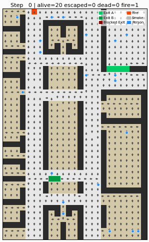
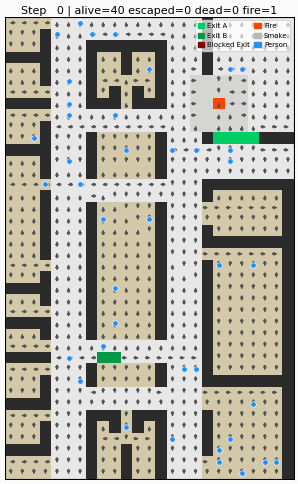
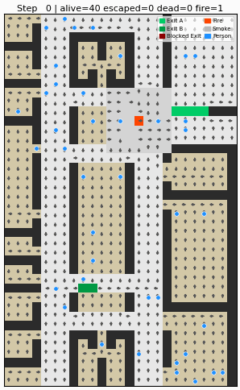
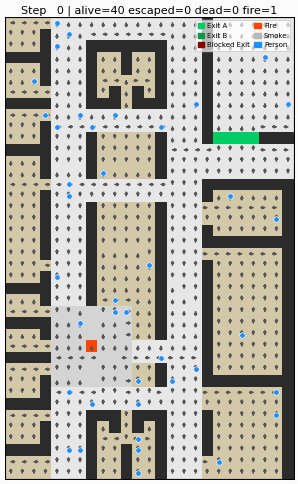

# 피난안내도 그리드 자동 추출 및 강화학습 기반 유도등 제어를 통한 화재 대피 시뮬레이션

조수연 · 임가영 · 주요셉 · 김병수 — 서울과학기술대학교 창의융합대학 인공지능응용학과

---

## 개요

피난안내도 이미지에서 그리드 맵을 자동으로 추출하고, 강화학습(PPO)으로 유도등 방향을 실시간 제어하는 3단계 파이프라인입니다.  
기존 정적 유도등 시스템과 달리 화재 확산·군중 밀집을 반영한 **동적 경로 갱신**이 가능하며, 방재 요원의 인지적 부하를 낮춥니다.

```
[피난안내도 이미지]
      │  Stage 1: OpenCV 색상 마스킹 → 그리드 변환
      ▼
[40×25 그리드 맵 (grid_map.npy)]
      │  Stage 2: 커리큘럼 기반 PPO 강화학습
      ▼
[학습된 PPO 정책 — 3개 연속 행동으로 유도등 실시간 제어]
      │  Stage 3: Python 시각화 / Unity 3D 시뮬레이션
      ▼
[2D GIF 검증] ·············· [Unity 기반 3D 시각화]
```

---

## 관련 연구

동적 대피 유도(dynamic evacuation guidance)에 강화학습을 적용한 선행 연구와의 비교.
이 프로젝트의 차별점: (1) 그리드 크기에 독립적인 15차원 고정 관측(F1~F15)으로 인원 수
N에 무관하게 추론 속도 일정, (2) A* 3개 변형(Hazard-aware/Simple/Pure)과의 직접 비교로
"왜 정적 A*가 아니라 학습된 정책이 필요한가"를 정량적으로 제시.

| 연구 | 접근 방법 | 이 프로젝트와의 차이 |
|---|---|---|
| Xie et al. (2025) [3] | CTM 기반 메조스코픽 군중 모델 + PyroSim 화재 시뮬레이션 + QMIX(MARL)로 동적 표지판 최적화 | 가장 근접한 선행 연구(동적 유도등 + 화재 전파 + RL) — 다만 멀티에이전트 QMIX로 표지판 자체를 에이전트화하는 반면, 본 프로젝트는 단일 정책이 전역 출구 가중치를 출력하는 단순한 구조 |
| Xu et al. (2021) [4] | 다중 출구 대피를 DRL로 시뮬레이션 (Transactions in GIS) | 화재 확산·병목을 명시적으로 모델링하지 않음 — 정적 다중 출구 선택 문제에 가까움 |
| Zhang, Chai & Lykotrafitis (2021) [5] | Social force model 기반 particle dynamics 환경 + DRL(Dyna-Q), 오목 장애물 회피 | 개별 에이전트 경로계획이 목적 — 본 프로젝트처럼 "유도 시스템(출구 가중치)"을 학습하는 것이 아니라 에이전트 자체의 이동 정책을 학습 |
| Lee et al. (2025) [2] | F_A\* — A\* 알고리즘 기반 화재 상황 대피 경로 탐색 | 학습 없는 휴리스틱 경로탐색 — 본 프로젝트의 A\* 베이스라인과 같은 계열, RL 비교 대상 |

> **데이터 방식 비교**: 위 4편 모두 실제 화재·군중 raw 데이터를 쓰지 않는다 —
> 가장 근접한 선행연구인 Xie et al. (2025)도 실제 노래방 건물의 **평면도만**
> 실사용하고 화재·군중 자체는 CTM+PyroSim 시뮬레이션이다(본 프로젝트가 Unity
> 평면도는 실사용, 화재·군중은 시뮬레이션인 구조와 동일). 순수 시뮬레이션이
> 이 니치(RL 기반 화재/군중 대피)의 표준 관행임을 선행연구로 확인했다.

---

## 실험 결과

> 조건: 30 에피소드 | EXIT_CAPACITY=1 / CELL_CAPACITY=1 병목 적용 | PPO 3,000,000 학습 스텝

### 시나리오별 성능 비교 (표 3)

정적 유도등(최초 1회 계산 후 화재·군중 상태와 무관하게 고정 — EC directive
92/58/EEC 준수 표준 표지판과 같은 원리)을 이 분야 표준 비교군으로 추가했다.

| 시나리오 | 인원 | 정적 유도등 생존율 | A\* 생존율 | PPO 생존율 | 정적 Step | A\* Step | PPO Step |
| :--- | :---: | :---: | :---: | :---: | :---: | :---: | :---: |
| S1 기본 탈출 | 20명 | 99.8±0.9 | 99.8±0.9 | **99.8±0.9** | 68±15 | 79±18 | **63±16** |
| S2 EXIT A 위협 | 40명 | 82.8±10.2 | 79.2±17.3 | **85.7±6.1** | 95±15 | 99±21 | **90±19** |
| S3 진입로 차단 | 40명 | 86.2±6.6 | 87.1±6.1 | **88.1±6.3** | 79±12 | 83±11 | **78±11** |
| S4 양방향 동시 위협 | 40명 | 65.2±32.5 | 66.8±33.6 | 66.0±31.2 | 80±17 | 82±23 | **73±17**† |
| S5 EXIT B 위협 (미학습, OOD) | 40명 | — | 85±9 | 74±6 | — | 106±15 | 103±15 |

> 핵심: 세 전략 모두 생존율은 비교적 근접하다 — 이 시뮬레이션 엔진
> (`env_core._compute_bfs_with_risk`)이 화재·연기 셀 회피를 Dijkstra 비용
> 함수에 항상 켜두기 때문에(어떤 전략이든 최소한의 위험 회피는 공유), "정적
> 신호는 화재를 완전히 무시한다"는 문헌상의 극단적 가정만큼 차이가 크게
> 벌어지지 않는다 — 이는 설계상의 사실이며 과장하지 않는다. 대신 **PPO의
> 강점은 모든 시나리오에서 일관되게 나타나는 완료 시간 단축**이다(4개
> 시나리오 전부 PPO가 최소 Step) — 특히 S2(혼잡 병목)에서는 생존율도 A\*보다
> +6.5%p 높다. PPO는 F7/F8(출구 혼잡도)을 실시간 인식해 병목 상황에서 출구
> 분산을 유도하는 반면, 정적/A\*는 이 피처 자체를 쓰지 않는다.
>
> **S4(양방향 동시 위협)에서는 생존율이 세 전략 다 사실상 동률**(A\*/PPO
> paired t-test p=0.41 — 유의하지 않음)이지만, † **완료 시간 차이는
> 통계적으로 유의**하다(paired t-test p=0.0072, Wilcoxon p=0.0075, n=30).
>
> **S5(EXIT B 위협)는 커리큘럼 학습에 전혀 포함되지 않은 시나리오**다
> (`env_core.py`의 커리큘럼은 S1~S4까지만 진행) — 즉 정책이 한 번도 보지
> 못한 화재 패턴에서의 일반화 성능을 보려고 의도적으로 남겨둔 out-of-
> distribution 테스트다. A\*(85%)에는 못 미치지만 **한 번도 학습하지 않은
> 시나리오에서도 74% 생존율을 유지**한다는 것 자체가 관측 공간(F1~F15)이
> 특정 시나리오에 과적합되지 않고 어느 정도 전이(transfer)된다는 근거로
> 해석한다.
>
> S4는 `--seed 42`로 A\*/PPO가 매 에피소드 동일한 화재·시작 조건을 겪도록
> 페어링해 재현 가능하게 재측정했다(`experiments/exp1_compare.py --seed`
> 신규 옵션). 나머지 시나리오는 아직 비결정적 실행 결과라 재현성이 없고,
> 값비교 유의성 검정도 못 붙였다 — 다음 단계로 동일하게 페어링해 재측정할
> 예정이다.

---

## A\* vs PPO 시각화 비교

> `■` 빨강: 화재 | `●` 초록/파랑: 대피자 | 화살표: 유도등 방향

### S1 — 기본 탈출 (20명, 고정 화재)

| A\* (Hazard-aware) | PPO |
| :---: | :---: |
|  |  |

### S2 — EXIT A 위협 (40명, 우측 구역 화재)

| A\* (Hazard-aware) | PPO |
| :---: | :---: |
|  |  |

### S3 — 진입로 차단 (40명, EXIT A 접근로 화재)

| A\* (Hazard-aware) | PPO |
| :---: | :---: |
|  |  |

### S4 — 양방향 동시 위협 (40명, 출구 A·B 구역 화재)

| A\* (Hazard-aware) | PPO |
| :---: | :---: |
|  |  |

---

## 방법론

### Stage 1 — 피난안내도 그리드 추출

Unity 에디터에서 캡처한 2층 평면도 이미지를 처리해 `grid_map.npy` (40×25 정수 배열)를 생성합니다.

| 단계 | 처리 내용 |
| :--- | :--- |
| 색상 필터링 | HSV 범위로 빨강·파랑 노이즈 제거 |
| 이진화 | 어두운 픽셀(벽·칸막이)을 검은색으로 추출 |
| 연결 컴포넌트 | 작은 아티팩트 제거 |
| 그리드 매핑 | 픽셀 → 셀 타입 (HALL / WALL / EXIT / ROOM) |

```bash
cd stage1
python gridcell_extract.py
# 출력: grid_map.npy, grid_cell_vis.jpg
```

---

### Stage 2 — 강화학습 기반 유도등 제어

#### 모델 프로세스 (4계층 구조)

```
LAYER 1 — 입력 및 매핑
  그리드 맵 (40×25) + 화재·연기·군중 상태
          ↓
LAYER 2 — 정책 및 의사 결정 (PPO)
  관측 벡터 F1~F15 (15차원) → PPO 신경망
  → [exit_A_cost, exit_B_cost, crowd_weight]
          ↓
LAYER 3 — 방향 최적화 (Dijkstra Cost Map)
  화재 위험 + 연기 위험 + 군중 밀도 → 비용 맵
  Dijkstra 경로 탐색 → 각 셀 최적 방향 결정
          ↓
LAYER 4 — 실행 및 피드백
  유도등 방향 갱신 → 군중 이동 → 생존율 보상 → PPO 학습
```

---

#### 관측 공간 (F1~F15)

15차원 스칼라 피처 — 3채널 상태(화재·군중·연기)를 40×25 그리드로 압축한 관측 벡터. 그리드 크기에 독립적이며 Unity 이식 가능.

| 인덱스 | 피처 | 내용 |
| :---: | :--- | :--- |
| F1 | 출구 A 화재 위협 | 화재→출구A 최단거리 / 20 (1=안전, 0=위험) |
| F2 | 출구 B 화재 위협 | 화재→출구B 최단거리 / 20 |
| F3 | 출구 A 선호 비율 | 출구 A가 더 가까운 생존자 비율 |
| F4 | 탈출 완료 비율 | |
| F5 | 사망 비율 | |
| F6 | 시간 경과 비율 (긴급도) | |
| **F7** | **출구 A 근접 혼잡도** | BFS 거리 4 이내 생존자 비율 ★ |
| **F8** | **출구 B 근접 혼잡도** | BFS 거리 4 이내 생존자 비율 ★ |
| F9 | 평균 공황 수준 | Helbing (2000) |
| F10 | 생존자→출구 A 평균 BFS 거리 | / 50 정규화 |
| F11 | 생존자→출구 B 평균 BFS 거리 | / 50 정규화 |
| F12 | 화재 무게중심 행 | / ROWS |
| F13 | 화재 무게중심 열 | / COLS |
| F14 | 출구 A 위협 변화율 | 이전 스텝 대비 F1 감소량 |
| F15 | 출구 B 위협 변화율 | 이전 스텝 대비 F2 감소량 |

> ★ **F7/F8**: A\*는 이 피처를 사용하지 않으므로 병목 상황에서 출구 분산 유도 불가.

---

#### 커리큘럼 데이터셋 (표 1)

최근 50 에피소드 평균 탈출완료율 ≥ 85% 달성 시 자동 진급.

| 단계 | 시나리오 | 인원 | 화재 위치 | 확산 확률 | 진급 조건 |
| :---: | :--- | :---: | :--- | :---: | :--- |
| S1 | 기본 탈출 | 20명 | 고정 위치 | 3% | 탈출완료 ≥ 90% |
| S2 | EXIT A 위협 | 40명 | 우측 구역 상단 | 12% | 탈출완료 ≥ 85% |
| S3 | 진입로 차단 | 40명 | EXIT A 접근로 | 18% | 탈출완료 ≥ 85% |
| S4 | 양방향 동시 위협 | 40명 | 출구 A·B 구역 | 15% | 탈출완료 ≥ 80% |

---

#### 보상 함수 (표 2)

| 이벤트 | 보상 |
| :--- | :---: |
| EXIT 탈출 성공 | +20.0 |
| 출구 방향 접근 (urgency 배율 ×1.0~×3.0) | +Δ |
| 화재·연기 사망 | −20.0 |
| 에피소드 종료 시 미탈출 1명당 | −15.0 |
| 두 출구 모두 사용 (분산 보너스) | +15.0 |

> **urgency 배율**: 스텝 경과에 따라 ×1.0 → ×3.0으로 증가 (타임아웃 억제)

---

#### 추론 속도 비교 (그림 5)

PPO는 15차원 고정 관측으로 전체 상황을 요약해 행동 3개로 제어하므로, 인원 수 N에 관계없이 속도가 일정합니다.

| 모델 | N=20 | N=200 | 특징 |
| :--- | :---: | :---: | :--- |
| A\* (Hazard-aware) | ~50ms | ~2,000ms+ | N명당 N회 BFS 탐색 필요 |
| **PPO** | **~1.5ms** | **~1.5ms** | 신경망 forward pass 1회 — **38배 빠름** |

---

## 설치 및 실행

```bash
pip install -r requirements.txt
```

```bash
# Stage 1: 그리드 추출
cd stage1
python gridcell_extract.py

# Stage 2 작업 디렉토리
cd stage2

# PPO 학습 (커리큘럼 S1→S4 자동 진급)
python train_ppo_grid.py --mode train --steps 3000000

# 전체 시나리오 비교 실험 (표 3)
python experiments/exp1_compare.py

# 추론 속도 비교 (그림 5)
python experiments/exp_speed.py

# 에피소드 GIF 시각화 (그림 6)
python experiments/exp3_visualize.py

# A* 베이스라인 테스트
python baselines/astar_baseline.py --all-scenarios --episodes 30
python baselines/astar_simple_baseline.py --all-scenarios --episodes 30
python baselines/astar_real.py --all-scenarios --episodes 30

# 정적 유도등 베이스라인 (이 분야 표준 비교군)
python baselines/static_signage_baseline.py --all-scenarios --episodes 30

# 시드 페어링 + 정적 유도등 포함 전체 비교 (표 3 재현)
python experiments/exp1_compare.py --scenarios 1 2 3 4 --episodes 30 --seed 42 --include-static

# TensorBoard 학습 지표 확인
tensorboard --logdir ./fire_evac_log/
```

---

## 파일 구조

```
Unity-FireEvacSim-pipeline/
├── requirements.txt
│
├── stage1/
│   ├── gridcell_extract.py          # 피난안내도 이미지 → grid_map.npy (Stage 1)
│   ├── image.jpg                    # 원본 Unity 평면도
│   └── grid_map.npy                 # 추출된 40×25 그리드
│
└── stage2/
    ├── env_core.py                  # 핵심 환경 (FireEvacEnv, 시나리오, 보상)
    ├── train_ppo_grid.py            # PPO 커리큘럼 학습 메인 스크립트
    ├── train_common.py              # 체크포인트·VecNormalize 유틸리티
    ├── unity_interface.py           # Python ↔ Unity 3D 연동 인터페이스
    ├── record_episode.py            # 에피소드 기록 (recordings/*.jsonl 생성)
    ├── playback_server.py           # 기록된 에피소드 재생 서버
    ├── visualize_episode.py         # 2D GIF 렌더링 엔진
    ├── make_visualize_episode.py    # 시각화 스크립트 (VISUALIZE_README 참고)
    ├── make_visualize_episode_test.py
    ├── make_comparison_gifs.py      # A* vs PPO 비교 GIF 생성
    ├── make_comparison_gifs_2.py    # 비교 GIF 생성 (개선판)
    ├── make_gridworld_map.py        # 포스터용 그리드월드 맵 시각화
    ├── plot_exp1_table.py           # 표 3 그래프 생성
    ├── plot_speed_cached.py         # 그림 5 포스터용 차트 생성
    ├── plot_obs_design_split.py     # 관측 공간 설계 비교 그래프
    ├── poster_grid.py               # 그림 4: A* vs PPO 경로 비교 그리드
    │
    ├── ppo/
    │   └── ppo_train.py             # PPO 학습·테스트 모듈
    │
    ├── baselines/
    │   ├── astar_baseline.py         # Hazard-aware A* (화재·연기·혼잡 반영)
    │   ├── astar_simple_baseline.py  # Simple A* (화재 무시, 순수 최단거리)
    │   ├── astar_real.py             # Pure A* (Manhattan 휴리스틱)
    │   └── static_signage_baseline.py # 정적 유도등 (최초 1회 계산 후 고정, 이 분야 표준 비교군)
    │
    ├── experiments/
    │   ├── exp1_compare.py          # 시나리오별 A* vs PPO 비교 (표 3)
    │   ├── exp3_visualize.py        # 에피소드 GIF 시각화 (그림 6)
    │   └── exp_speed.py             # 추론 속도 비교 (그림 5)
    │
    ├── recordings/                  # 시나리오별 기록된 에피소드 (*.jsonl)
    ├── figures/                     # 포스터·그림용 정적 이미지
    ├── model/                       # 학습된 PPO 모델 (.zip, _vecnorm.pkl)
    │   └── ppo/
    ├── result/                      # 실험 결과 JSON
    │   ├── ppo/
    │   ├── astar/
    │   ├── astar_real/
    │   ├── astar_simple/
    │   ├── exp1_compare/
    │   └── visualize/               # GIF·PNG 시각화 결과
    └── fire_evac_log/               # TensorBoard 로그
```

> **참고**: `stage2/model/`, `stage2/logs/`에는 RecurrentPPO·JointPPO·AutoregressivePPO로
> 학습한 체크포인트·로그도 일부 남아 있으나, 해당 알고리즘들의 학습 소스 코드(`env_joint.py`,
> `train_joint.py`, `autoregressive_ppo/` 등)는 이후 정리 커밋에서 삭제되어 현재는 위 PPO
> 파이프라인만 재현 가능합니다. 세 변형을 실제로 비교 결과에 포함하려면 코드 복원이 필요합니다.

---

## 추가 문서

- [KCI 저널 게재를 위한 보완 사항 분석](docs/kci-submission-gap-analysis.md)
- [시뮬레이션 파라미터 근거표](docs/simulation-parameter-justification.md) — raw 데이터셋 부재를 문헌 근거로 방어하는 문서

## 참고 문헌

- [1] J. Schulman et al., "Proximal Policy Optimization Algorithms," *arXiv:1707.06347*, 2017.
- [2] H.-K. Lee et al., "Research Evacuation Route Search in Case of Fire Using the F_A\* Algorithm Based on the A\* Algorithm," *Fire Sci. Eng.*, vol. 39, no. 1, pp. 22–32, 2025.
- [3] C.-Z. Xie et al., "Coordinating Dynamic Signage for Evacuation Guidance: A Multi-Agent Reinforcement Learning Approach Integrating Mesoscopic Crowd Modeling and Fire Propagation," *Chaos, Solitons & Fractals*, 2025.
- [4] D. Xu, X. Huang, J. Mango, X. Li, & Z. Li, "Simulating multi-exit evacuation using deep reinforcement learning," *Transactions in GIS*, 2021.
- [5] Y. Zhang, Z. Chai, & G. Lykotrafitis, "Deep reinforcement learning with a particle dynamics environment applied to emergency evacuation of a room with obstacles," *Physica A*, 571, 2021.
- Fruin, J. J. (1971). *Pedestrian Planning and Design*. Metropolitan Association of Urban Designers.
- Helbing, D., Farkas, I., & Vicsek, T. (2000). Simulating dynamical features of escape panic. *Nature*, 407, 487–490.
- Henderson, L. F. (1974). On the fluid mechanics of human crowd motion. *Transportation Research*, 8(6), 509–515.
