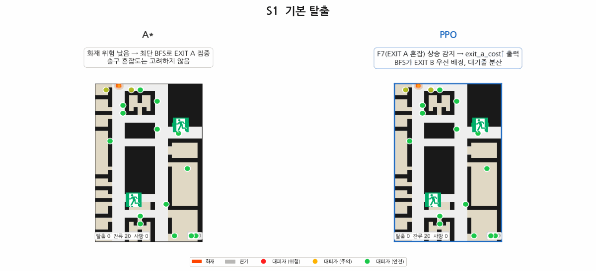
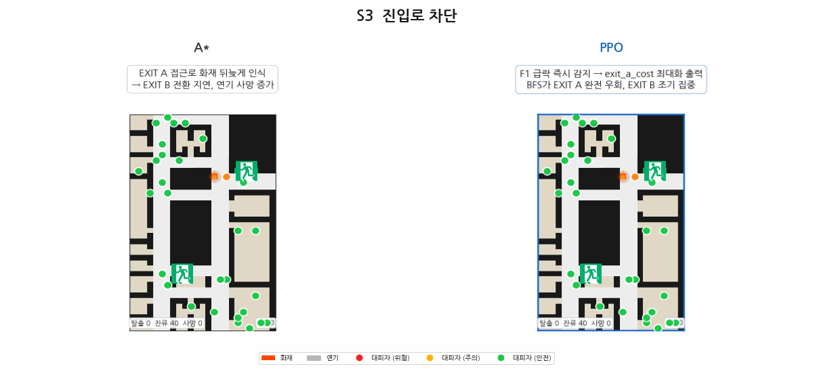
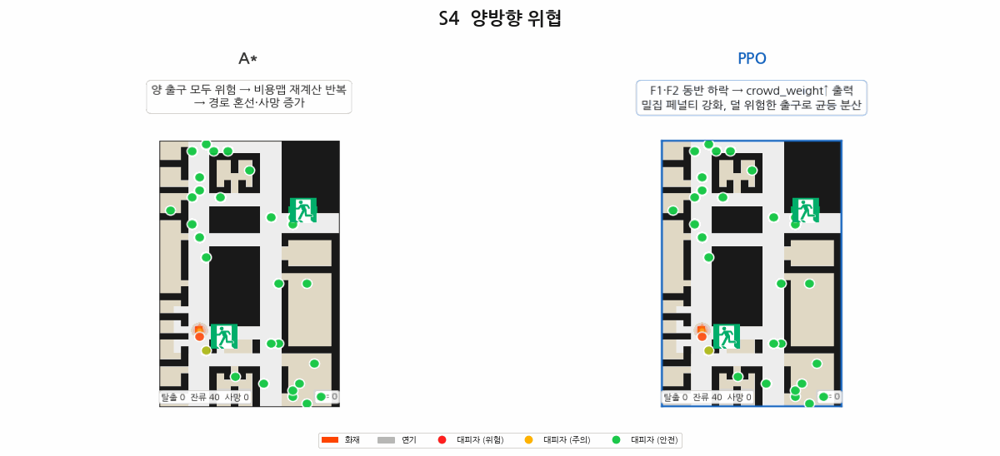
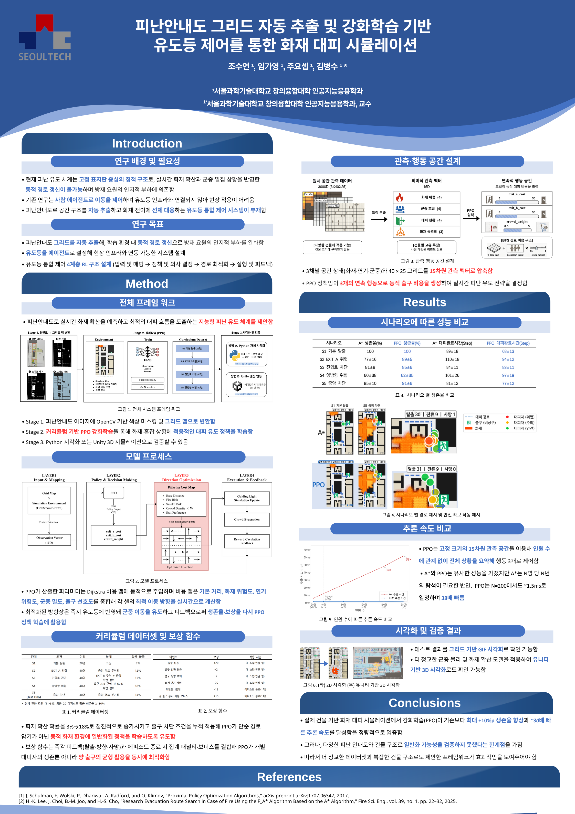

# 피난안내도 그리드 자동 추출 및 강화학습 기반 유도등 제어를 통한 화재 대피 시뮬레이션

조수연 · 임가영 · 주요셉 · 김병수 (서울과학기술대학교 창의융합대학 인공지능응용학과)

---

## 개요

피난안내도 이미지에서 그리드 맵을 자동으로 추출하는 영상처리 모듈과,
강화학습(PPO)으로 유도등 방향을 실시간 제어하는 강화학습 모듈로 구성된
3단계 프레임워크를 제안한다. 각 모듈은 독립적으로 설계·검증했으며, 모듈 간
결합은 아래에서 바로 설명하듯 아직 이뤄지지 않았다(상세: "한계 및 향후
연구" 절).  
기존 정적 유도등과 달리 화재 확산·군중 밀집을 반영한 **동적 경로 갱신**이 가능하고, 방재 요원의 인지적 부하도 낮춘다.

```
[피난안내도 이미지]                     ← Stage 1은 이 사진 한 장으로 독립 검증됨
      │  Stage 1: OpenCV 색상 마스킹 → 그리드 변환
      ▼
[40×25 그리드 맵 (grid_map.npy)]        ← 실제로는 아래 화살표로 안 이어짐(미통합)
      ┊  Stage 2: 커리큘럼 기반 PPO 강화학습    Stage 2가 학습에 쓰는 그리드는
      ▼                                         Unity 씬에서 별도로 만든 것
[학습된 PPO 정책: 3개 연속 행동으로 유도등 실시간 제어]
      │  Stage 3: Python 시각화 / Unity 3D 시뮬레이션
      ▼
[2D GIF 검증] ·············· [Unity 기반 3D 시각화]
```

**Stage 1과 Stage 2는 각각 독립적으로 검증됐다.** 지금 학습된 정책이 쓰는
그리드는 Unity 에디터에서 만든 씬을 내보낸 것이고, Stage 1(사진→그리드 자동
추출)은 같은 건물 사진 한 장을 별도로 검증했다(자체 출구 도달 가능률
100%, 출구 검출 100%. 상세: [Stage 1 추출 정확도
평가](docs/stage1-extraction-accuracy.md)). 두 구성 요소를 하나로 잇는 건
다음 단계다.

---

## 관련 연구

동적 대피 유도(dynamic evacuation guidance)에 강화학습을 적용한 선행 연구와 비교했다.
차별점은 두 가지다: (1) 그리드 크기에 독립적인 4차원 고정 관측(F1, F2, F14, F15 —
화재 위협과 그 변화율만 남긴 축소판, 상세는 아래 "관측 공간" 절)으로 인원 수 N과
무관하게 추론 속도가 일정, (2) A*뿐 아니라 위험정보를 동일하게 사용하는 비학습
Hazard-aware BFS까지 비교해 "강화학습이 기여한 몫"과 "위험정보 사용 자체가 기여한
몫"을 분리해서 제시.

| 연구 | 접근 방법 | 이 프로젝트와의 차이 |
|---|---|---|
| Xie et al. (2025) [3] | CTM 기반 메조스코픽 군중 모델 + PyroSim 화재 시뮬레이션 + QMIX(MARL)로 동적 표지판 최적화 | 가장 근접한 선행 연구(동적 유도등 + 화재 전파 + RL). 멀티에이전트 QMIX로 표지판 자체를 에이전트화하는 반면, 본 프로젝트는 단일 정책이 전역 출구 가중치를 출력하는 단순한 구조 |
| Xu et al. (2021) [4] | 다중 출구 대피를 DRL로 시뮬레이션 (Transactions in GIS) | 화재 확산·병목을 명시적으로 모델링하지 않고 정적 다중 출구 선택 문제에 가까움 |
| Zhang, Chai & Lykotrafitis (2021) [5] | Social force model 기반 particle dynamics 환경 + DRL(Dyna-Q), 오목 장애물 회피 | 개별 에이전트 경로계획이 목적. 본 프로젝트처럼 "유도 시스템(출구 가중치)"을 학습하는 게 아니라 에이전트 자체의 이동 정책을 학습 |
| Lee et al. (2025) [2] | F_A\*(A\* 알고리즘 기반 화재 상황 대피 경로 탐색) | 학습 없는 휴리스틱 경로탐색. 본 프로젝트의 A\* 베이스라인과 같은 계열, RL 비교 대상 |

> **데이터 방식 비교**: 위 4편 모두 실제 화재·군중 raw 데이터를 쓰지 않는다.
> 가장 근접한 선행연구인 Xie et al. (2025)도 실제 노래방 건물의 **평면도만**
> 실사용하고 화재·군중 자체는 CTM+PyroSim 시뮬레이션이다(본 프로젝트가 Unity
> 평면도는 실사용, 화재·군중은 시뮬레이션인 구조와 동일). 순수 시뮬레이션이
> 이 니치(RL 기반 화재/군중 대피)의 표준 관행이다.

---

## 방법론

### Stage 1: 피난안내도 그리드 추출

실제 피난안내도 사진을 처리해 `base_grid.npy`(40×25 정수 배열)를 생성한다.
**확정 파이프라인은 `build_base_grid.py`(Hough Line 기반)다** —
`gridcell_extract.py`는 이 프로젝트 초기의 프로토타입으로, 출구·문 검출이
없고 벽 검출도 크기 기반이라 화장실 픽토그램 같은 곡선형 아이콘을 벽으로
오탐하는 문제가 있어 대체됐다.

| 단계 | 처리 내용 |
| :--- | :--- |
| 색상 마스킹 | HSV 범위로 빨강·파랑 노이즈 제거 |
| 어두운 픽셀 이진화 | 벽 후보 추출(벽·칸막이) |
| **직선 성분 필터링** | **Hough Line Transform으로 축 정렬 직선만 벽으로 인정, 곡선형 아이콘 오탐 제거** |
| 외곽 마스킹 | 건물 외곽 컨투어 밖을 WALL로 지정(촘촘한 마스크 기준) |
| 문 기호 검출 | 템플릿 매칭으로 문 셀 개방(이 도면 전용, 일반화 안 됨) |
| 출구 검출 | 녹색 표지 색상으로 EXIT 식별 |
| 그리드 매핑 | 픽셀 영역 → 40×25 셀 (HALL / WALL / EXIT / ROOM) |

```bash
cd stage1
python build_base_grid.py
# 출력: base_grid.npy, base_grid_vis.jpg
```

> 정확도(WALL IoU 0.658, 출구 도달률 100% 등) 상세는 "한계 및 향후 연구"
> 절과 [Stage 1 추출 정확도 평가](docs/stage1-extraction-accuracy.md) 참고.
> `gridcell_extract.py`는 회귀 비교용으로만 저장소에 남아있다.

---

### Stage 2: 강화학습 기반 유도등 제어

#### 모델 프로세스 (4계층 구조)

```
LAYER 1: 입력 및 매핑
  그리드 맵 (40×25) + 화재·연기·군중 상태
          ↓
LAYER 2: 정책 및 의사 결정 (PPO)
  관측 벡터 F1, F2, F14, F15 (4차원) → PPO 신경망
  → [exit_A_cost, exit_B_cost, crowd_weight]
          ↓
LAYER 3: 방향 최적화 (Dijkstra Cost Map)
  화재 위험 + 연기 위험 + 군중 밀도 → 비용 맵
  Dijkstra 경로 탐색 → 각 셀 최적 방향 결정
          ↓
LAYER 4: 실행 및 피드백
  유도등 방향 갱신 → 군중 이동 → 생존율 보상 → PPO 학습
```

---

#### 관측 공간 (F1, F2, F14, F15 — 4차원 확정판)

**프로덕션 모델은 4차원 관측을 쓴다.** 원래 설계는 3채널 상태(화재·군중·연기)를
15개 스칼라로 요약한 관측이었으나, 개별·그룹 단위 마스킹(ablation)으로 정보
중복성을 검증한 결과 11개 피처(F3~F13)를 제거해도 생존율이 통계적으로
구분되지 않았다. 이 근거로 화재 위협과 그 변화율만 남긴 4차원으로 처음부터
재학습했고, 15차원 모델과 동등한 성능을 확인했다(상세 경위:
[피처 공간 최적화 계획](docs/feature-space-optimization-plan.md)).

| 인덱스 | 피처 | 내용 |
| :---: | :--- | :--- |
| F1 | 출구 A 화재 위협 | 화재→출구A 최단거리 기반 안전도 (1=안전, 0=위험) |
| F2 | 출구 B 화재 위협 | 화재→출구B 최단거리 기반 안전도 |
| F14 | 출구 A 위협 변화율 | 이전 스텝 대비 F1 감소량 |
| F15 | 출구 B 위협 변화율 | 이전 스텝 대비 F2 감소량 |

> 코드에서는 `FireEvacEnv(feature_set="reduced")`로 활성화한다(기본값
> `"full"`은 기존 15차원 그대로 유지해 하위 호환). 그리드 크기·대피자 수와
> 무관하게 차원이 고정되므로 Unity 이식에도 유리하다.

<details>
<summary>원래 15차원 전체 정의 (feature_set="full", 비교/회귀 테스트용으로 유지)</summary>

| 인덱스 | 피처 | 내용 |
| :---: | :--- | :--- |
| F1 | 출구 A 화재 위협 | 화재→출구A 최단거리 / 20 (1=안전, 0=위험) |
| F2 | 출구 B 화재 위협 | 화재→출구B 최단거리 / 20 |
| F3 | 출구 A 선호 비율 | 출구 A가 더 가까운 생존자 비율 |
| F4 | 탈출 완료 비율 | |
| F5 | 사망 비율 | |
| F6 | 시간 경과 비율 (긴급도) | |
| F7 | 출구 A 근접 혼잡도 | BFS 거리 4 이내 생존자 비율 |
| F8 | 출구 B 근접 혼잡도 | BFS 거리 4 이내 생존자 비율 |
| F9 | 평균 공황 수준 | Helbing (2000) |
| F10 | 생존자→출구 A 평균 BFS 거리 | / 50 정규화 |
| F11 | 생존자→출구 B 평균 BFS 거리 | / 50 정규화 |
| F12 | 화재 무게중심 행 | / ROWS |
| F13 | 화재 무게중심 열 | / COLS |
| F14 | 출구 A 위협 변화율 | 이전 스텝 대비 F1 감소량 |
| F15 | 출구 B 위협 변화율 | 이전 스텝 대비 F2 감소량 |

F7/F8(출구 근접 혼잡도)을 포함한 관측 클러스터를 통째로 가려도 생존율
낙폭이 ±1.6%p 이내였다 — "PPO가 F7/F8을 인식해 병목을 회피한다"는 인과
주장은 데이터로 뒷받침되지 않는다(상관된 다른 채널인 F3/F10/F11이 같은
정보를 대체할 수 있어서로 추정). 이게 바로 F3~F13을 제거해도 성능이
유지된 이유이자, 4차원 축소판을 채택한 근거다.

</details>

---

#### 커리큘럼 데이터셋 (표 1)

최근 50 에피소드 평균 탈출완료율이 `--curriculum-threshold`(단일 값, 전
단계 동일 적용) 이상이면 다음 시나리오로 자동 진급한다. **확정값은
0.85**다 — 원래 기본값 0.90으로는 3.5M 스텝을 끝까지 돌려도 S4 승급이
한 번도 일어나지 않아, 0.85로 낮춰 재검증했다(상세:
[Hazard-Awareness Ablation](docs/hazard-aware-ablation.md) 후속 분석 7).

| 단계 | 시나리오 | 인원 | 화재 위치 | 확산 확률 |
| :---: | :--- | :---: | :--- | :---: |
| S1 | 기본 탈출 | 20명 | 고정 위치 | 3% |
| S2 | EXIT A 위협 | 40명 | 우측 구역 상단 | 12% |
| S3 | 진입로 차단 | 40명 | EXIT A 접근로 | 18% |
| S4 | 양방향 동시 위협 | 40명 | 출구 A·B 구역 | 15% |

> 커리큘럼은 S1~S4까지만 진행되며(`--max-scenario 4`), S5(EXIT B 위협)는
> 학습에서 완전히 제외해 out-of-distribution 일반화 테스트로 남겨둔다.
> 상세는 실험 결과 절 참고.

---

#### 보상 함수 (표 2)

| 이벤트 | 보상 |
| :--- | :---: |
| EXIT 탈출 성공 | +20.0 |
| 출구 방향 접근 (urgency 배율 ×1.0~×3.0) | +Δ |
| 화재·연기 사망 | −20.0 |
| 에피소드 종료 시 미탈출 1명당 | −15.0 |
| 두 출구 모두 사용 (분산 보너스) | +15.0 |

> **urgency 배율**: 스텝 경과에 따라 ×1.0 → ×3.0으로 증가 (타임아웃 억제)
>
> **분산 보너스가 있어도 실제 학습된 정책은 균형보다 처리 효율을 우선한다**
> (Exit Balance 실측 결과는 실험 결과 절 참고). 다른 보상 항목(생존·사망·
> 잔류 페널티)의 크기가 더 커서, 최종적으로는 "고르게 나누기"보다 "더 나은
> 쪽으로 몰아 빨리 처리하기"가 우세한 전략으로 수렴한 것으로 보인다.

---

## 실험 결과

> 조건: 30 에피소드 | EXIT_CAPACITY=2 / CELL_CAPACITY=2(코드 현재값. 주석에는
> "학습은 1로 진행"이라고 적혀 있으나 미검증 — 최종 제출 전 실제 사용값 확정
> 필요, [paper-review-todo](docs/paper-review-todo-2026-10.md) 참고) | **4차원
> 축소 관측**(`feature_set="reduced"`)으로 PPO 3,506,176 스텝 학습(커리큘럼
> S1→S4, threshold=0.85, `--max-scenario 4`로 S5는 학습에서 제외) | `--seed 42`
> 페어링(네 전략이 매 에피소드 동일한 화재·시작 조건을 겪음)

### 시나리오별 성능 비교 (표 3)

네 가지 유도 전략을 비교한다. **정적 유도등**은 최초 1회 계산한 경로를
화재·군중 상태와 무관하게 고정한다(EC directive 92/58/EEC 준수 표준
표지판과 같은 원리로, 동적 유도등 문헌의 표준 비교군이다). **A\***는 매 스텝
재탐색하되 화재를 무시하는 순수 최단경로(Pure A\*, Manhattan 휴리스틱).
**Hazard-aware BFS**는 화재 셀을 통과 불가로 차단한 채 매 스텝 재탐색하는
비학습 휴리스틱으로, 위험정보를 PPO와 동일한 수준으로 사용한다(코드상
`astar_baseline.py`의 `bfs_action()` — 함수명과 달리 휴리스틱이 없는 순수
BFS다). **제안 정책(PPO)**은 4차원 관측으로 학습된 정책. 정적 유도등·A\*
모두 `hazard_aware=False`로 평가해 실제로 화재를 무시하도록 구현했다(구현
세부사항은 [Hazard-Awareness Ablation](docs/hazard-aware-ablation.md) 참고).

| 시나리오 | 인원 | 정적 유도등 | A\* | Hazard-aware BFS | 제안 정책(PPO) | PPO−A\* | PPO−BFS |
| :--- | :---: | :---: | :---: | :---: | :---: | :---: | :---: |
| S1 기본 탈출 | 20명 | 99.8±0.9 | 99.8±0.9 | 99.8±0.9 | **99.8±0.9** | 0.0 | 0.0 |
| S2 EXIT A 위협 | 40명 | 59.0±16.8 | 54.4±22.0 | 91.3±6.2 | **87.1±5.8** | +32.7‡ | −4.2‡ |
| S3 진입로 차단 | 40명 | 57.8±12.1 | 60.5±14.3 | 86.4±5.8 | **86.0±7.0** | +25.5‡ | −0.4(n.s.) |
| S4 양방향 동시 위협 | 40명 | 50.0±25.8 | 53.0±29.1 | 68.9±34.1 | **66.3±32.2** | +13.3‡ | −2.6‡ |
| S5 EXIT B 위협 (미학습, OOD) | 40명 | 63.1±15.4 | 67.1±20.5 | 89.6±7.0 | **80.3±7.9** | +13.3‡ | −9.3‡ |

| 시나리오 | 정적 Step | A\* Step | BFS Step | PPO Step |
| :--- | :---: | :---: | :---: | :---: |
| S2 | 71±15 | 76±17 | 102±21 | 98±18 |
| S3 | 58±10 | 62±14 | 84±10 | 84±8 |
| S4 | 66±15 | 70±14 | 84±19 | 75±17 |
| S5 | 74±12 | 84±14 | 105±17 | 91±11 |

> ‡ paired t-test 기준 유의(n=30, seed=42 페어링). **PPO vs A\***: S2
> p<0.0001, S3 p<0.0001, S4 p=0.0009, S5 p=0.0003 — S1을 제외한 전
> 시나리오에서 유의하게 높다. **PPO vs Hazard-aware BFS**: S2 p=0.0007,
> S3 **p=0.55(유의하지 않음)**, S4 p=0.0102, S5 p<0.0001 — S3에서만 차이가
> 통계적으로 확인되지 않았고(이것이 "동등함의 증거"는 아니다, 단지 "본
> 평가에서 뚜렷한 차이가 확인되지 않음"), 나머지 세 시나리오는 모두 PPO가
> **유의하게 낮다**. S1은 전 방법이 ~100%로 수렴하는 천장 효과라 검정
> 대상에서 제외.
>
> **핵심은 비교 대상을 어디로 잡느냐에 따라 결론이 갈린다는 점이다.**
> 화재를 무시하는 A\* 대비로는 PPO가 전 시나리오에서 뚜렷하게 우위지만,
> 위험정보를 동일하게 쓰는 Hazard-aware BFS 대비로는 학습 시나리오에서도
> 대등하거나 열세이고 미학습 시나리오(S5)에서는 격차가 가장 크다(−9.3%p).
> 즉 A\* 대비 개선분의 상당 부분은 "강화학습"이 아니라 "위험정보 사용
> 자체"에서 나온다. 이 구분이 왜 중요한지는 바로 아래 추론 속도 절에서
> 이어진다 — 생존율에서 못 이기는 Hazard-aware BFS를 계산 비용에서는
> 압도적으로 이긴다.

**메커니즘: "출구 분산"이 아니라 "결단력 있는 쏠림"**. Exit Balance(양쪽
출구 균등 사용도)와 Throughput(스텝당 처리 인원)을
`experiments/compute_extra_metrics.py`로 분해하면, PPO의 Exit Balance는
A\*보다 오히려 낮다(S2: 0.221 vs 0.411, S3: 0.245 vs 0.400, S4: 0.381 vs
0.496, S5: 0.356 vs 0.435). 대신 Throughput은 항상 A\*보다 높다(S2: 0.364
vs 0.302, S3: 0.414 vs 0.403, S4: 0.344 vs 0.300, S5: 0.360 vs 0.322). 즉
PPO는 양쪽 출구에 고르게 나누는 게 아니라, 더 안전하거나 빠른 쪽 출구로
과감하게 몰아 처리 효율을 극대화하는 전략을 학습했다. 다만 이 전략이 특정
관측 채널(예전 15차원 설계의 F7/F8 "출구 근접 혼잡도")을 인식해서 나온
행동이라는 인과 관계는 확인되지 않았다 — 오히려 그 채널을 포함한 관측
클러스터를 통째로 가려도 생존율 낙폭이 ±1.6%p 이내였다(그룹 ablation,
[Feature Space Optimization](docs/feature-space-optimization-plan.md) 참고).
이게 바로 F7/F8을 포함한 11개 피처를 제거하고 4차원으로 축소해도 성능이
유지된 이유이기도 하다.

**S5(EXIT B 위협)는 커리큘럼 학습에 전혀 포함되지 않은 시나리오**다.
`env_core.py`의 커리큘럼은 S1~S4까지만 진행하며 `--max-scenario 4`로
학습 중 진급이 원천 차단되어 있다. A\* 대비로는 미학습 시나리오에서도
유의하게 높은 생존율(+13.3%p)을 보이지만, Hazard-aware BFS 대비로는
네 시나리오 중 가장 큰 격차(−9.3%p)로 뒤진다. 따라서 "미학습 조건에서도
일정한 대피 성과를 유지한다"는 주장은 가능해도, "위험 반영 탐색보다
일반화를 잘한다"는 주장은 데이터가 뒷받침하지 않는다. 동일 건물 내 화재
위치 변화이므로 다른 건축물로의 전이 성능으로 확대 해석하지도 않는다.

---

#### 추론 속도 비교 (그림 5)

> **2026-10 정정**: 아래 표는 `experiments/exp_speed_breakdown.py`(신규)로
> 측정한 **전체 제어주기(T_control)** 기준이다. 이전 버전은 PPO 쪽은
> 신경망 forward pass(T_policy)만 쟀고 Hazard-aware BFS 쪽은 경로탐색
> 전체를 쟀다 — 측정 범위가 달라 "전체 제어 속도"의 공정한 비교가
> 아니었다(지도교수 검토 메모 3.1절 지적, 상세:
> [paper-review-todo](docs/paper-review-todo-2026-10.md)). T_policy만
> 보면 0.14~0.18ms지만, 실제로는 Dijkstra 비용장 생성(T_costmap+guidance)이
> 전체 제어주기의 ~90%를 차지해 **T_control은 6.6~7.2ms**다.

PPO는 4차원 고정 관측으로 전체 상황을 요약해 행동 3개로 제어하므로, 전체
제어주기가 인원 수 N에 거의 무관하다. Hazard-aware BFS는 생존자마다 개별
탐색을 돌려야 해서 O(N)으로 선형 증가한다. N=20/50/100/150/200/300/500
7단계로 측정했다(S4, M1 8코어 CPU, 단독 실행·다른 프로세스와 CPU 경합 없음).

| N | T_observation | T_policy | T_costmap+guidance | **T_control(합계)** | Hazard-aware BFS(전체) |
| :---: | :---: | :---: | :---: | :---: | :---: |
| 20 | 0.22ms | 0.27ms | 6.07ms | **6.56ms** | 8.5ms |
| 50 | 0.37ms | 0.22ms | 6.21ms | **6.80ms** | 26.3ms |
| 100 | 0.56ms | 0.20ms | 5.88ms | **6.64ms** | 47.4ms |
| 150 | 0.46ms | 0.21ms | 6.01ms | **6.68ms** | 74.9ms |
| 200 | 0.64ms | 0.20ms | 5.90ms | **6.74ms** | 97.7ms |
| 300 | 0.68ms | 0.35ms | 6.18ms | **7.21ms** | 170.4ms |
| 500 | 0.86ms | 0.19ms | 5.84ms | **6.88ms** | 255.1ms |

> T_control은 N=20~500 전 구간에서 6.6~7.2ms로 거의 평평하다(비용맵
> 생성이 그리드 크기에만 의존하고 N에는 거의 안 의존해서다 — T_observation만
> N에 따라 소폭 증가). Hazard-aware BFS는 **"실시간" 기준을 100ms/스텝으로
> 잡으면 N≈200~300 사이에서 이 기준을 넘는다**(N=200: 97.7ms, N=300:
> 170.4ms). 제안 정책은 N=500에서도 T_control이 7ms 미만이라 이 기준을
> 넘길 여지가 구조적으로 거의 없다.
>
> **측정 한계**: `_compute_dirs_for_strategy()`가 Dijkstra 비용장 생성과
> 방향 결정을 한 함수 안에서 같이 수행해, 현재 코드 구조로는 T_costmap과
> T_guidance를 더 세분화된 두 타이머로 분리하지 못했다(리팩터링 없이는
> 합산값까지만 보고 가능). 또한 Hazard-aware BFS는 "관측 구성"과
> "경로탐색"이 분리되지 않은 단일 함수라 같은 4단계로는 분해할 수 없어,
> 위 비교는 "PPO의 T_control 합계" 대 "BFS 함수 1회 호출 전체"의 비교다.

---

## A\* vs PPO 시각화 비교

> `■` 빨강: 화재 | `●` 초록/파랑: 대피자 | 화살표: 유도등 방향 | A\*·PPO를 한 이미지에
> 나란히 비교(`make_comparison_gifs_2.py` 생성, seed=42로 표 3과 동일 조건)

### S1: 기본 탈출 (20명, 고정 화재)



### S2: EXIT A 위협 (40명, 우측 구역 화재)


### S3: 진입로 차단 (40명, EXIT A 접근로 화재)



### S4: 양방향 동시 위협 (40명, 출구 A·B 구역 화재)



> **(업데이트됨, 2026-08-20)**: 이 GIF 내 캡션은 "덜 위험한 출구로 균등 분산"이라고
> 적혀 있으나, 이후 Exit Balance 실측(위 실험 결과 절 참고)으로 정정됐다. 실제로는
> "균등 분산"이 아니라 "더 안전한 쪽으로 결단력 있게 몰아 처리 효율을 높이는" 전략이다.
> GIF는 재생성 전까지 구버전 캡션 그대로 유지한다.

### S5: EXIT B 위협 (40명, 미학습 OOD)


> **(업데이트됨, 2026-08-20)**: GIF 내부 제목은 "중앙 차단"으로 표시되지만, 이 문서
> 전반의 "S5"는 `env_core.SCENARIO_CONFIGS[5]`("EXIT B 위협")를 가리킨다. 재생성
> 전까지 GIF 자체의 표시 제목은 구버전 그대로다.

---

## 발표 포스터



> **(업데이트됨, 2026-08-20)**: 이 포스터는 hazard_aware 버그 수정
> ([Hazard-Awareness Ablation](docs/hazard-aware-ablation.md) 참고) 이전
> 버전이라 아래 항목들이 본문 표 3·그림 5와 다르다.
>
> - **표 3 수치**: 포스터는 정적 유도등 없이 A\*/PPO 2-way 비교이고 생존율
>   자체가 다르다(예: S2 포스터 A\*77±16/PPO89±5 vs 본문 A\*54.4±22.0/
>   PPO85.7±6.1). 정적 유도등 베이스라인은 버그 수정 이후에 추가됐다.
> - **완료 시간 방향성이 반대다**: 포스터는 PPO가 A\*보다 항상 빠르다고
>   보고하지만, 재측정 결과는 반대다. S2/S3/S5에서는 정적·A\*가 화재를
>   무시하고 직진해 PPO보다 스텝 수가 적다(대신 훨씬 많이 죽는다). 속도와
>   생존율의 트레이드오프로 재해석됐다(본문 표 3 해설 참고).
> - **추론 속도 "38배" 요약**: 포스터는 N=200에서 PPO ~1.5ms, 38배 빠르다고
>   요약하지만, 재실측 결과 PPO는 ~0.16ms(O(1) 고정), A\*는 53.6ms이고
>   배율은 N에 따라 10배~849배까지 변한다(본문 그림 5 참고). 단일 배율
>   요약은 오해 소지가 있어 본문에서는 제거했다.
> - **표 1 화재 확산 확률**: 포스터는 S3 15%/S4 18%로 적혀 있는데 본문 표 1은
>   S3 18%/S4 15%로 반대다. 본문 표 1은 현재 `env_core.SCENARIO_CONFIGS`
>   코드값과 일치시킨 것이다.
> - **S5 라벨**: 포스터의 "S5 중앙 차단"은 이후 `SCENARIO_CONFIGS[5]`
>   ("EXIT B 위협")로 이어지는데, 이 명칭 불일치는 아직 완전히 해소되지
>   않았다(위 시각화 절 각주 참고).
> - Conclusion의 "+10%p 생존율, ~30배 속도" 요약도 재측정 후 시나리오별로
>   +12.3%p~+31.2%p, 배율 10배~849배로 훨씬 크고 가변적으로 나타났다.

---

## 설치 및 실행

```bash
pip install -r requirements.txt
```

```bash
# Stage 1: 그리드 추출
cd stage1
python gridcell_extract.py

# Stage 2 작업 디렉토리
cd stage2

# PPO 학습 (4차원 축소 관측, 커리큘럼 S1→S4 자동 진급, S5는 --max-scenario로 제외)
python ppo/ppo_train.py --mode train --people 40 --steps 3506176 \
    --feature-set reduced --curriculum-threshold 0.85 --ent-coef 0.005 --max-scenario 4

# 시드 페어링 + 정적·A*·Hazard-aware BFS 포함 전체 비교 (표 3 재현)
python experiments/exp1_compare.py --scenarios 1 2 3 4 5 --episodes 30 --seed 42 \
    --feature-set reduced --include-static --include-hazard-astar

# 전체 제어주기 시간 분해 측정 (그림 5, T_observation+T_policy+T_costmap+guidance)
python experiments/exp_speed_breakdown.py --scenarios 4 --feature-set reduced \
    --n-agents-list 20 50 100 150 200 300 500

# (구버전) 신경망 추론시간만 비교 — T_policy만 재므로 전체 제어 속도 비교로는 쓰지 말 것
python experiments/exp_speed.py --n-agents 200 --feature-set reduced

# 에피소드 GIF 시각화 (그림 6)
python experiments/exp3_visualize.py

# A* 베이스라인 단독 테스트
python baselines/astar_baseline.py --all-scenarios --episodes 30          # Hazard-aware
python baselines/astar_simple_baseline.py --all-scenarios --episodes 30   # Simple (화재 무시)
python baselines/astar_real.py --all-scenarios --episodes 30              # Pure (화재 무시)
python baselines/static_signage_baseline.py --all-scenarios --episodes 30 # 정적 유도등

# 보조 평가지표 (Exit Balance / Throughput / Path Efficiency)
python experiments/compute_extra_metrics.py --scenario 4 --csv <exp1_compare.py 출력 CSV>

# TensorBoard 학습 지표 확인
tensorboard --logdir ./fire_evac_log/
```

---

## 파일 구조

```
Unity-FireEvacSim-pipeline/
├── requirements.txt
│
├── stage1/
│   ├── build_base_grid.py           # 피난안내도 이미지 → base_grid.npy (Stage 1, Hough Line 확정판)
│   ├── gridcell_extract.py          # 초기 프로토타입(회귀 비교용, 출구/문 검출 없음)
│   ├── build_ground_truth.py        # 정확도 평가용 수작업 정답 제작
│   ├── eval_extraction_accuracy.py  # WALL IoU·연결성 보존율·출구 도달률 평가
│   ├── image.jpg                    # 원본 피난안내도 사진
│   ├── door_template.png            # 문 기호 템플릿(이 도면 전용)
│   └── base_grid.npy                # 추출된 40×25 그리드
│
└── stage2/
    ├── env_core.py                  # 핵심 환경 (FireEvacEnv, 시나리오, 보상, hazard_aware 플래그)
    ├── train_ppo_grid.py            # 3,000차원 그리드 관측 ablation (별도 실험, 본 프로젝트 주 모델 아님)
    ├── train_common.py              # 커리큘럼 래퍼·체크포인트·VecNormalize 유틸리티
    ├── unity_interface.py           # Python ↔ Unity 3D 연동 인터페이스
    ├── record_episode.py            # 에피소드 기록 (recordings/*.jsonl 생성)
    ├── playback_server.py           # 기록된 에피소드 재생 서버
    ├── visualize_episode.py         # 2D GIF 렌더링 엔진
    ├── make_visualize_episode.py    # 시각화 스크립트 (VISUALIZE_README 참고)
    ├── make_visualize_episode_test.py
    ├── make_comparison_gifs.py      # A* vs PPO 비교 GIF 생성
    ├── make_comparison_gifs_2.py    # 비교 GIF 생성 (개선판)
    ├── make_gridworld_map.py        # 포스터용 그리드월드 맵 시각화
    ├── plot_exp1_table.py           # 표 3 그래프 생성
    ├── plot_speed_cached.py         # 그림 5 포스터용 차트 생성
    ├── plot_obs_design_split.py     # 관측 공간 설계 비교 그래프
    ├── poster_grid.py               # 그림 4: A* vs PPO 경로 비교 그리드
    │
    ├── ppo/
    │   └── ppo_train.py             # PPO 커리큘럼 학습 메인 스크립트 (--feature-set reduced=F1,F2,F14,F15/4차원[기본 프로덕션], full=F1~F15/15차원[하위호환])
    │
    ├── baselines/
    │   ├── astar_baseline.py          # Hazard-aware A* (화재·연기·혼잡 반영)
    │   ├── astar_simple_baseline.py   # Simple A* (화재 무시, 순수 최단거리)
    │   ├── astar_real.py              # Pure A* (Manhattan 휴리스틱, 표 3 기준)
    │   └── static_signage_baseline.py # 정적 유도등 (최초 1회 계산 후 고정, 이 분야 표준 비교군)
    │
    ├── experiments/
    │   ├── exp1_compare.py            # 시나리오별 정적/A*/Hazard-aware BFS/PPO 비교, 시드 페어링 (표 3)
    │   ├── exp3_visualize.py          # 에피소드 GIF 시각화 (그림 6)
    │   ├── exp_speed.py               # 추론 속도 비교 — T_policy(신경망 추론)만 측정, 구버전
    │   ├── exp_speed_breakdown.py     # 전체 제어주기 분해 측정 (그림 5, T_control 기준, 확정판)
    │   ├── feature_ablation.py        # F1~F15 개별 permutation 마스킹
    │   ├── feature_group_ablation.py  # F1~F15 그룹 단위 마스킹 (HAZARD/CROWD/PROGRESS/ALL_BLIND)
    │   ├── feature_correlation.py     # F1~F15 15×15 상관행렬
    │   └── compute_extra_metrics.py   # Exit Balance / Throughput / Path Efficiency
    │
    ├── recordings/                  # 시나리오별 기록된 에피소드 (*.jsonl)
    ├── figures/                     # 포스터·그림용 정적 이미지
    ├── model/                       # 학습된 PPO 모델 (.zip, _vecnorm.pkl)
    │   └── ppo/
    ├── result/                      # 실험 결과 JSON
    │   ├── ppo/
    │   ├── astar/
    │   ├── astar_real/
    │   ├── astar_simple/
    │   ├── exp1_compare/
    │   └── visualize/               # GIF·PNG 시각화 결과
    └── fire_evac_log/               # TensorBoard 로그
```

---

## 한계 및 향후 연구

**단일 건물 검증**: 모든 실험이 실제 상상관 2층 평면도 하나로 수행됐다.
Stage 1(이미지→그리드 자동 추출)이 임의의 평면도를 지원하므로 구조적으로
다른 건물에 대한 zero-shot 일반화 검증이 가능하지만, 아직 두 번째 평면도로
실측하지는 않았다. 다만 선행연구(Xie et al. 2025 등) 중에도 여러 건물로
검증한 사례가 없어, 단일 건물 검증 자체가 이 분야에서 이례적인 것은
아니다.

**Stage 1은 실제 학습에 쓰인 그리드의 출처가 아니다**: 지금 학습된 모델이
쓰는 `env_core.BASE_GRID`는 이 사진(`stage1/image.jpg`)에서 자동 추출된 게
아니라, Unity 에디터에서 수작업으로 만든 3D 씬을 내보낸 것이다(코드 주석
확인). 즉 "사진 → 그리드 자동 추출 → 학습"이라는 E2E 파이프라인은 지금
결과물 기준으로는 실제로 이어져 있지 않다. Stage 1(`build_base_grid.py`)은
별도로 검증된 확장 경로다.

통합이 막힌 이유는 그리드 품질(WALL IoU)만이 아니다. `env_core.py`의
`EXIT_A_POS`/`EXIT_B_POS`와 시나리오별 화재 발생 구역(`_EXIT_A_UPPER`,
`_EXIT_A_CROSSING`, `_EXIT_B_LOWER`, `_CENTER_CORRIDOR`)이 전부 지금
Unity 그리드의 구체적 좌표에 손으로 맞춰져 있어서(2026-09-17 확인),
Stage 1 그리드로 교체하려면 해상도를 맞추는 것과 별개로 이 좌표들을
새 그리드의 건물 구조에 맞게 다시 지정해야 한다. 단순 상수 재조정으로
끝나지 않는 별도 설계 작업이라 이번 통합에서는 범위 밖으로 뒀다.

이 사진 한 장에 대해 직접 만든 정답과 비교한 결과: 셀 단위 정확도(pixel
accuracy) 80.0%, WALL IoU 65.8%, 경계 1칸 오차까지 허용하는 관대한 매칭
기준으로는 recall 94.1%/precision 94.3%, 출구(EXIT) 검출은 recall/precision
모두 100%. 자체 출구 도달 가능률(그리드 내 모든 보행 가능 셀이 출구까지
닿는 비율)은 원래 45%에서 건물 외곽 마스킹·문 검출 개선(98.1%)과 벽 검출
자체를 색상/크기 기준에서 직선(Hough Line) 기준으로 바꾼 개선(100%)을
거쳐 끌어올렸다. 화장실 픽토그램처럼 곡선형 아이콘을 벽으로 오탐하던 문제를
"벽은 직선, 아이콘은 곡선"이라는 전제로 상당 부분 줄였지만, 여전히
단순 규칙 기반 방식이라 CubiCasa5K급 딥러닝 방법(mIoU ~87%)보다 정밀도가
낮고, 엘리베이터·소화기 표지판 같은 직선 위주 아이콘은 이 방식으로도 안
걸러진다. 표본이 사진 1장뿐이라 오차의 신뢰구간도 논할 수 없다. 상세:
[Stage 1 추출 정확도 평가](docs/stage1-extraction-accuracy.md) Phase E.

**밀도 일반화 경계**: 커리큘럼 학습은 최대 40명까지만 진행된다. S4에서 N을
40→500까지 늘려가며 4차원 모델로 재측정한 결과(n=8), A\* 대비 생존율
우위는 N=200까지는 유지되지만(N=40: +12.8%p → N=80: +11.2%p → N=120:
+12.1%p → N=160: +8.6%p → N=200: +8.0%p) **N=300 이상에서는 사실상
사라진다**(N=300: +0.3%p, N=500: +0.1%p). 역전까지는 아니지만, 학습
밀도(≤40명)를 10배 이상 벗어나면 생존율 우위를 더 이상 주장할 수 없다.
이 비교 상대는 Hazard-aware BFS가 아니라 A\*이므로, "인원이 늘어도 위험
반영 탐색보다 우수하다"는 뜻은 아니다. T_control(전체 제어주기, 위 추론
속도 절 참고)은 N=500에서도 7ms 미만으로 일정해 계산 비용 우위는 밀도와
무관하게 유지된다 — **생존율과 계산 비용은 서로 다른 평가축이며, 고밀도
구간에서는 전자가 무너지고 후자만 남는다.**

**인원수(N) 설정 근거 미확정**: 커리큘럼은 20~40명 규모로 학습한다. 이
규모가 실제 상상관 2층 건물에 적절한지 뒷받침하는 근거가 아직 없다. 그리드
셀 1개가 실제 몇 ㎡에 대응하는지 정의된 곳이 없어서, 소방법령 수용인원
기준(국가화재안전기준, 또는 NFPA 101 occupant load factor)과 대조하는 게
현재는 불가능하다. 건물의 실제 면적 자료를 확보하는 대로 이 계산을 채워
넣을 계획이다.

**PPO 아키텍처 미검증**: 지금 PPO는 기본 MLP(`net_arch=[256, 256]`) 구조
그대로이고, 지역성 요약 레이어 같은 경량 모듈 추가는 아직 실험하지 않았다.
엔트로피 계수(`ent_coef`) 감사는 40만 스텝 기준으로는 기존 기본값 0.05가
낫다고 결론 냈었지만, production 길이(3.5M 스텝)까지 끝까지 학습하면
`log_std`가 발산해 exit 비용 액션이 경계값에 고정되는 문제가 뒤늦게
발견됐다. 근본 원인은 엔트로피가 아니라 정책망의 초기 출력 스케일과 액션
박스가 어긋나 있던 것이었고, `action_net`의 초기 bias를 박스 중간값으로
맞추는 수정으로 해소했다(상세: [Hazard-Awareness
Ablation](docs/hazard-aware-ablation.md) 후속 분석 6,
[피처 공간 최적화 계획](docs/feature-space-optimization-plan.md)). GAE
λ·learning rate schedule 등 나머지 하이퍼파라미터는 아직 검토하지 않았다.
커리큘럼 학습(S1→S4 순차 진급) 자체의 효과는 옛 ent_coef=0.05 기준으로
검증했다. 같은 조건(40만 스텝)에서 커리큘럼 없이 S4로 바로 학습한
모델(53.3±36.6%)과 비교하면 커리큘럼 쪽이 +12.15%p 높고 분산도 더
작지만(65.4±28.2%), n=30 표본에서 통계적으로 유의한 수준은 아니었다(상세는
[Hazard-Awareness Ablation](docs/hazard-aware-ablation.md) 후속 분석 4·5).
이 비교 자체는 위 수정판(`ent_coef=0.005` + bias 초기화) 기준으로는 아직
재검증 전이다. 다만 수정판으로 재학습하는 과정에서 승급 기준(최근 50
에피소드 평균 생존율 0.90 이상)이 S4에서 한 번도 충족되지 않는다는 걸
발견해, 기준을 0.85로 낮춰 다시 학습하니 처음으로 S4까지 승급했고 S4·S5
생존율이 함께 개선됐다(상세: 후속 분석 7). 승급 기준 자체도 재검증이
필요한 하이퍼파라미터였던 셈이다.

**피처 공간(F1~F15) 최적화 — 완료, 4차원으로 축소 확정**: 관측 벡터
15차원은 초기 설계 이후 재검토 없이 쓰여오다가, 액션 경계값 고정 버그(위
"PPO 아키텍처 미검증" 항목)를 고친 **정상 작동 모델 기준으로** permutation
개별·그룹 마스킹과 15×15 상관행렬 분석을 재검증했다. F3·F7·F8·F10·F11이
"출구 선호"라는 같은 축을 중복 인코딩하고(|r| 0.64~0.95), F1/F13·F2/F12도
이 건물 형상에 고정돼 상관이 높았던 반면(|r| 0.85~0.90), **F1/F2와
F14/F15는 예상과 달리 독립적이었다**(|r|<0.06). 그룹 단위로 가려도(HAZARD/
CROWD/PROGRESS/ALL_BLIND) 낙폭이 ±4.4%p 이내였고, 이 근거로 **F1, F2,
F14, F15 4개만 남긴 축소 관측을 설계해 처음부터 재학습했다**(`feature_set=
"reduced"`). 15차원 모델과 통계적으로 구분되지 않는 성능을 확인해 이제
이게 프로덕션 기본 모델이다(상세 숫자는 위 "관측 공간" 절, 전체 경위는
[피처 공간 최적화 계획](docs/feature-space-optimization-plan.md)).

Kim & Ha(2020)가 보고한 "observation dropout으로 불필요한 관측 채널을
제거해도 정책 성능이 유지된다"는 결과와 방향이 일치한다. S1(20명)도
동일 절차(3,506,176 스텝, threshold=0.85)로 4차원으로 재학습해 두 인원대
(20명·40명) 모두 프로덕션 모델이 4차원으로 교체됐다.

**재현 불가능한 아키텍처 변형**: `stage2/model/`, `stage2/logs/`에는
RecurrentPPO·JointPPO·AutoregressivePPO로 학습한 체크포인트·로그가 일부
남아 있으나, 해당 소스 코드는 정리 과정에서 삭제됐다(각 변형 모두
30시간 이상 학습해도 수렴하지 않아 폐기됨). 이 결과물들은 현재 재현
불가능하며, 표 3 등 어떤 비교에도 포함하지 않았다.

**학회 제출용 외부 원고와의 정합성(진행 중)**: 한국시뮬레이션학회논문지
투고를 위해 이 저장소 밖에서 별도로 작성 중인 확장 원고를 지도교수가
검토한 결과, (1) 시나리오 구성표에서 S5가 실제 `SCENARIO_CONFIGS[5]`
("EXIT B 위협")가 아니라 S6("중앙 경로 차단")으로 잘못 적힌 부분, (2)
생존율 표에서 S3의 A\* 값이 복사 오류로 정적 유도등 값과 같게 적힌 부분
(정확한 값은 60.5, 위 표 3 참고), (3) 참고문헌 서식이 학회 공식 양식과
다른 부분이 아직 남아있다. 상세와 체크리스트는
[paper-review-todo-2026-10.md](docs/paper-review-todo-2026-10.md).

**Raw 데이터셋**: 화재·군중 실측 데이터는 윤리적·현실적으로 수집이
불가능해 사용하지 않았다. 이는 이 분야(RL 기반 화재/군중 대피)의 표준
관행이며, 선행연구 4편 모두 동일하다. 군중 물리 모델(Fruin 1971, Helbing
2000)을 검증할 수 있는 실측 보행자 데이터는 별도로 공개돼 있다(상세는
[시뮬레이션 파라미터 근거표](docs/simulation-parameter-justification.md)).

---

## 추가 문서

- [KCI 저널 게재를 위한 보완 사항 분석](docs/kci-submission-gap-analysis.md)
- [시뮬레이션 파라미터 근거표](docs/simulation-parameter-justification.md): raw 데이터셋 부재를 문헌 근거로 방어하는 문서
- [Hazard-Awareness Ablation](docs/hazard-aware-ablation.md): "화재 무시" 베이스라인이 실제로는 화재를 회피하던 버그와 수정 전후 비교, N 스케일링·Exit Balance 후속 분석
- [피처 공간(F1~F15) 최적화 계획](docs/feature-space-optimization-plan.md): permutation·그룹 ablation과 상관분석으로 중복성을 검증하고, F1/F2/F14/F15 4차원 축소판을 재학습까지 완료한 전체 경위
- [Stage 1 추출 정확도 평가](docs/stage1-extraction-accuracy.md): 사진 1장 기준 ground truth 대비 표준 지표·관대한 매칭·연결성 보존율 평가, 문헌 대조
- [논문 투고 전 보완 사항 (2026-10)](docs/paper-review-todo-2026-10.md): 한국시뮬레이션학회논문지 투고용 확장 원고 검토에서 나온 사실관계 오류(시나리오표·생존율표 오타)와, 정책 추론시간만 쟀던 기존 속도 비교를 전체 제어주기(T_observation+T_policy+T_costmap+guidance) 분해 측정으로 보완한 내역

## 참고 문헌

- [1] J. Schulman et al., "Proximal Policy Optimization Algorithms," *arXiv:1707.06347*, 2017.
- [2] H.-K. Lee et al., "Research Evacuation Route Search in Case of Fire Using the F_A\* Algorithm Based on the A\* Algorithm," *Fire Sci. Eng.*, vol. 39, no. 1, pp. 22–32, 2025.
- [3] C.-Z. Xie et al., "Coordinating Dynamic Signage for Evacuation Guidance: A Multi-Agent Reinforcement Learning Approach Integrating Mesoscopic Crowd Modeling and Fire Propagation," *Chaos, Solitons & Fractals*, 2025.
- [4] D. Xu, X. Huang, J. Mango, X. Li, & Z. Li, "Simulating multi-exit evacuation using deep reinforcement learning," *Transactions in GIS*, 2021.
- [5] Y. Zhang, Z. Chai, & G. Lykotrafitis, "Deep reinforcement learning with a particle dynamics environment applied to emergency evacuation of a room with obstacles," *Physica A*, 571, 2021.
- [6] J. T. Kim & S. Ha, "Observation Space Matters: Benchmark and Optimization Algorithm," *arXiv:2011.00756*, 2020.
- [7] S. Zeng, X. Yang, X. Yeung, S. Fu, & W. Chun, "Deep Floor Plan Recognition Using a Multi-Task Network with Room-Boundary-Guided Attention," *ICCV*, 2019.
- [8] A. Kalervo, J. Ylioinas, M. Häikiö, A. Karhu, & J. Kannala, "CubiCasa5K: A Dataset and an Improved Multi-Task Model for Floorplan Image Analysis," *arXiv:1904.01920*, 2019.
- [9] L.-P. de las Heras, O. R. Terrades, S. Robles, & G. Sánchez, "Statistical segmentation and structural recognition for floor plan interpretation," *IJDAR*, 2014.
- [10] C. Liu, J. Wu, P. Kohli, & Y. Furukawa, "Raster-to-Vector: Revisiting Floorplan Transformation," *ICCV*, 2017.
- Fruin, J. J. (1971). *Pedestrian Planning and Design*. Metropolitan Association of Urban Designers.
- Helbing, D., Farkas, I., & Vicsek, T. (2000). Simulating dynamical features of escape panic. *Nature*, 407, 487–490.
- Henderson, L. F. (1974). On the fluid mechanics of human crowd motion. *Transportation Research*, 8(6), 509–515.
